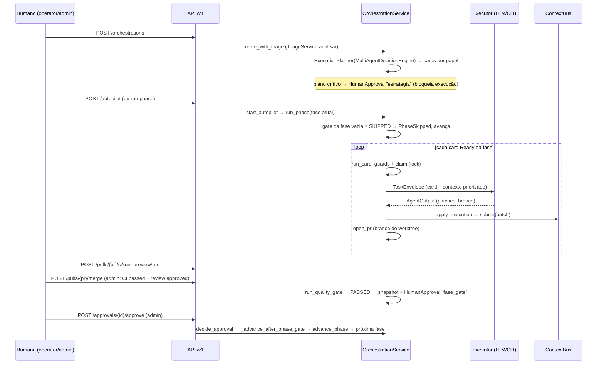

# Como o ASO funciona (visão de 30 minutos)

Leitura curta para quem chega agora. Detalhes: [arquitetura](architecture.md),
[governança (regra → código → teste)](GOVERNANCE.md), [API](api.md). As funções citadas são
chamadas pela façade `application/orchestration_service.py` (`OrchestrationService`) e implementadas
nos serviços de `src/aso/application/` (ADR-0066).

## 1. Glossário

| Termo | O que é no código |
|---|---|
| **Papel** | Rótulo de agente com seções do contexto que pode escrever e fase padrão — `agents/registry.py` (`AgentRegistry`, `FASE_PADRAO_POR_PAPEL`), permissões no `PermissionPolicy` do ContextBus. Ex.: `BackendDevelopmentAgent`. |
| **Executor** | Perfil do catálogo que roda a tarefa: `mock`, `llm` (API) ou `cli` (Codex/Claude Code via `scripts/aso-agent-wrapper.sh`) — `execution/catalog.py` (`ExecutorProfile`, `ExecutorCatalog`). |
| **Função de agente** | Pergunta em JSON feita a um executor: triagem (`control/triage.py`), discovery (`control/discovery.py`), especificação (`control/spec.py`), revisão (`control/review.py`), nomeação (`control/naming.py`) — todas via `control/agent_ask.py::perguntar_ao_agente`. Implementação e documentação são **execuções** (`run_card`, `analyze_folder`). |
| **Fase** | F1–F7 (`shared/types.py::Phase`): marco de governança com gate próprio. |
| **Etapa** | Passo do `fluxo.md` §1–§24; várias etapas cabem numa fase (tabela abaixo). |
| **Card** | Unidade de trabalho do Kanban (`kanban/models.py::KanbanCard`), com fase, papel, dependências e claim de execução (ADR-0058). |
| **Ledger** | O `OrchestratorContext` (`governance/context_store.py`): memória de trabalho escrita **só** pelo `ContextBus` (`governance/contextbus.py`) e lida pelos agentes via `agents/context_builder.py`. |
| **Gate** | `run_quality_gate` + critérios por fase (`governance/gate_definitions.py`): `PASSED`, `FAILED` ou `SKIPPED` (nada bloqueante a verificar). |
| **Snapshot** | Cópia do ledger após gate `PASSED` que congela seções da fase (`governance/snapshot_engine.py`, ADR-0061). |
| **Aprovação** | `HumanApproval` (`governance/models.py`) decidida por admin em `decide_approval`: estratégia crítica, patch pendente, avanço de fase, implantação. |
| **Restaurar ledger** | `restaurar_ledger` (antigo `rollback`): volta **só** o contexto a um snapshot — não reverte código nem board. |

| Fase | Etapas do `fluxo.md` |
|---|---|
| F1 Discovery & Strategy | §1 entrada, §2 classificação (triagem), §3–§4 discovery e aprovação |
| F2 Architecture / F3 Contracts / F4 UX & Planning | §5–§7 especificação, revisão documental, decomposição |
| F5 Engineering Execution | §8–§15 cards, seleção de agente, implementação, validações, falhas, revisão de código |
| F6 Quality, Docs & Deploy | §16–§22 QA manual, aprovação, implantação, validação, rollback de deploy, aceite |
| F7 Operate & Evolve | §23–§24 encerramento e aprendizado |

## 2. Fluxo de uma demanda

## 3. Onde está cada coisa

| Quero mudar… | Arquivo / função |
|---|---|
| Como a demanda é classificada | `control/triage.py::TriageService.analisar` (orquestrado por `application/intake.py`) |
| Quais agentes/estratégia são escolhidos | `control/decision_engine.py::MultiAgentDecisionEngine.decide` (via `ExecutionPlanner`), regras em `control/routing_rules.py` |
| Critérios do gate de uma fase | `governance/gate_definitions.py::DEFINICOES` (executados por `application/workflow.py::run_quality_gate`) |
| O que o agente recebe no prompt | `application/agent_task.py` (`_build_task`), `agents/context_builder.py`, `agents/prompt_builder.py`, `agents/render_prompt.py` |
| Execução de um card e retry | `application/execution.py` (`run_card`, `_apply_execution`, `_route_failure`; política em `control/failure.py`) |
| Regras de merge | `application/delivery.py` (`merge_pr`, `report_ci`, `report_review`) |
| Papéis e permissões HTTP | `api/auth.py::required_role` |
| Seções congeladas por fase | `governance/snapshot_engine.py::SECOES_CONGELADAS_POR_FASE` |
| Docs-first do workspace | `application/docs_first.py` (`analyze_folder`, `heal_docs`, ADR-0062) |
| Contrato HTTP | rotas em `api/routers/*.py` (compostas em `api/app.py`); contrato gerado em `contracts/openapi.json` |

## 4. Limites atuais

- Execução assíncrona (fila `jobs` + workers, ADR-0067) atrás de `ASO_EXECUCAO_ASSINCRONA`, ainda em processo único — réplicas: MEL-56. Cards independentes rodam em ondas paralelas por estratégia (ADR-0074).
- Execuções de agente sem registro próprio (`agent_runs`) e custo só do Claude CLI — MEL-30, MEL-41.
- Discovery e revisão leem o repositório só com executor CLI (worktree de leitura, ADR-0069); via LLM de API continuam sem acesso a arquivos.
- Regra de dependência entre módulos não verificada por lint — MEL-36.
- Artefatos do processo de construção do ASO misturados em `.aso/` — MEL-04.
