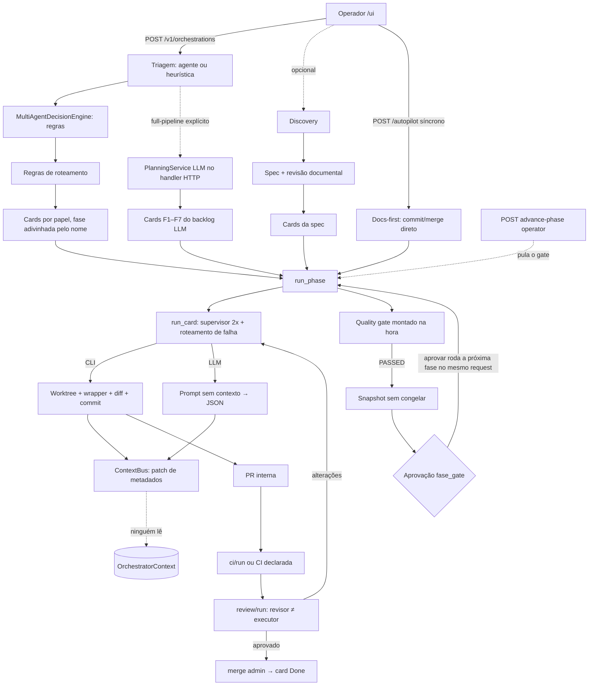
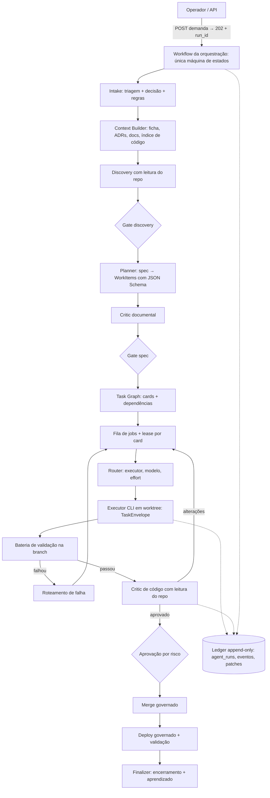

# Revisão arquitetural profunda — ASO Runtime

- **Data:** 2026-09-14
- **Base analisada:** branch `main` @ `164c6ab` (árvore limpa)
- **Escopo:** código-fonte, documentação, ADRs, infraestrutura, scripts, testes e UI

## Método

- Leitura integral do código: 24 mil linhas de Python em `src/aso/`, mais 8,4 mil linhas de HTML/JS do console.
- Leitura de cerca de 19 mil linhas de Markdown, incluindo as 55 ADRs, `requerimentos.md`, `fluxo.md` e `wiframe-fluxo.md`.
- Estrutura de testes: 1.356 testes coletados (`pytest --collect-only`). A suíte completa **não** foi executada, para evitar efeitos colaterais.
- Grafo real de imports calculado por script e comparado com o `module_map` declarado.
- 5 experimentos em memória (`OrchestrationService()` com provider mock), rodados fora do repositório. Nenhum arquivo do projeto foi alterado durante a análise.

**Legenda das evidências**

- **[F]** fato visto no código
- **[E]** fato confirmado executando
- **[H]** hipótese ou inferência não executada

**Checagem final ("entendi o fluxo real?"):** sim. A principal descoberta é que o fluxo real diverge do narrado em pontos estruturais, e não em detalhes.

---

## Sumário

1. [Entendimento do projeto](#1-entendimento-do-projeto)
2. [Fluxo real × fluxo documentado](#2-fluxo-real--fluxo-documentado)
3. [Coerência arquitetural](#3-coerência-arquitetural)
4. [Sistema multiagente](#4-sistema-multiagente)
5. [Clareza conceitual](#5-clareza-conceitual)
6. [O que está incompleto](#6-o-que-está-incompleto)
7. [Fluxos mortos e código órfão](#7-fluxos-mortos-e-código-órfão)
8. [Um dev novo entende em 30 minutos?](#8-um-dev-novo-entende-em-30-minutos)
9. [Debuggabilidade e observabilidade](#9-debuggabilidade-e-observabilidade)
10. [Documentação ideal](#10-documentação-ideal)
11. [Arquitetura idealizada](#11-arquitetura-idealizada)
12. [Roadmap de melhoria](#12-roadmap-de-melhoria)
13. [Resultado final](#13-resultado-final)
14. [Evidências dos experimentos](#14-evidências-dos-experimentos)

---

## 1. Entendimento do projeto

### Objetivo

Transformar uma demanda em entrega de código rastreável, coordenando agentes de código (Claude Code, Codex) e LLMs sob governança: Kanban, ADR, gates, snapshots e aprovações ([requerimentos.md §2](requerimentos.md)).

### Problema que resolve

Agentes de código perdem o contexto global, contrariam decisões anteriores e conflitam quando rodam em paralelo (requerimentos §4).

### Usuário real

Um operador técnico rodando localmente, pelo console `/ui`, com papéis viewer, operator e admin. Não é multi-tenant.

### Componentes reais

| Componente | Onde | Papel de fato |
|---|---|---|
| `OrchestrationService` | [orchestration_service.py](src/aso/control/orchestration_service.py) — 7.046 linhas, cerca de 260 métodos | Faz quase tudo: criação, execução, PR, CI, review, merge, discovery, spec, documentos, deploy, QA, incidentes, catálogos e consultas |
| API | [app.py](src/aso/api/app.py) — 2.669 linhas, 198 rotas | Adapter HTTP, mas com regra de negócio dentro (o planejamento LLM é montado no handler, [app.py:760](src/aso/api/app.py#L760)) |
| Console | [static/](src/aso/api/static/) — 29 páginas, 4 placeholders | UI principal |
| `MultiAgentDecisionEngine` | [decision_engine.py](src/aso/control/decision_engine.py) | Regras determinísticas que produzem um rótulo de estratégia e uma lista de papéis |
| Serviços com prompt próprio | `triage`, `naming`, `discovery`, `spec`, `review`, `planning` | São os "agentes" reais, com contrato JSON e fallback |
| ExecutionProviders | [cli_provider.py](src/aso/execution/cli_provider.py), [llm_provider.py](src/aso/execution/llm_provider.py), [catalog.py](src/aso/execution/catalog.py) | Executam o card: CLI em worktree, LLM devolvendo JSON, ou mock |
| ContextBus e ContextStore | [governance/](src/aso/governance/) | Registro versionado de patches (um ledger) |
| Roteamento de falha | [failure.py](src/aso/control/failure.py) | Diagnóstico por texto → mesmo agente / mais effort / trocar executor / bloquear / escalar |
| Persistência | [repository.py](src/aso/db/repository.py) | Reescreve o agregado inteiro a cada gravação |

### Quais agentes existem

A palavra "agente" tem três significados no código:

1. **Os 16 papéis** de [registry.py](src/aso/agents/registry.py). São só rótulos com seções de permissão no ContextBus: não têm prompt nem comportamento próprio. Seis nunca recebem card por nenhum caminho automático: `OrchestratorAgent`, `ProductStrategyAgent`, `RequirementsAgent`, `UxPlanningAgent`, `ConflictResolutionAgent` e `FinalResponseAgent` [F].
2. **Executores**: os perfis do catálogo (`claude -p`, `codex exec`, API de LLM, mock). São o "cérebro" de verdade.
3. **Funções de agente de fato**, cada uma com entrada, saída e fallback próprios:

| Função de agente | Entrada | Saída | Fallback |
|---|---|---|---|
| Triagem | Texto da demanda | `DemandBrief` | Heurística por palavra-chave |
| Planejamento (LLM via API) | Ideia | `ProjectPlan` (produto, ADRs, backlog F1–F7) | Nenhum (erro) |
| Discovery | Demanda + ficha + nomes de diretórios | `DiscoveryReport` | Heurística, confiança baixa |
| Especificação | Ficha + discovery aprovado | `SpecDocument` + itens de trabalho | Heurística |
| Revisão documental | Especificação | Veredito | Checagem determinística / `necessita_humano` |
| Implementador (card) | JSON da tarefa → prompt do wrapper | Diff/branch ou JSON | Roteamento de falha |
| Revisão de código | Diff (até 60k caracteres) + card | Veredito + comentários ancorados | `necessita_humano` (escala para humano na dúvida) |
| Nomeação | Card | Nome de branch e assunto de commit | Slug determinístico |
| Documentação docs-first | Módulos detectados | `docs/` no repositório-alvo | Scaffold |

### Existe orquestrador central?

Não existe um *agente* orquestrador. O orquestrador é código imperativo (`OrchestrationService`), mais as regras puras de [next_step.py](src/aso/control/next_step.py) (1.273 linhas) e as aprovações humanas.

### Como as tarefas nascem, são distribuídas e terminam

- **Criação — três origens de card [F]:**
  - (a) `create_orchestration`: um card por papel planejado. O título é gerado como "`BackendDevelopmentAgent: Único domínio de baixo risco.`" e o critério de aceite é "Output do agente aplicado via ContextBus" [E].
  - (b) `populate_from_plan`: backlog do LLM, só quando `execution_mode=full-pipeline` é enviado explicitamente.
  - (c) `_materialize_spec_cards`: itens da especificação aprovada.
- **Distribuição:** domínio → papel (`_DOMAIN_AGENTS`). O executor segue a precedência: explícito → override do card → etapa → orquestração → sugestão pela ficha → perfil.
- **Execução:** `run_card` → `AgentSupervisor` (2 tentativas) → provider → `_apply_execution` → roteamento de falha.
- **Revisão:** PR interna → `ci/run` → `review/run` (revisor diferente de quem executou; na dúvida, escala para humano) → `merge` (admin).
- **Fim:** o card só chega a Done no `merge_pr`. Uma fase termina com gate PASSED + aprovação humana. A orquestração termina ao aprovar F7.

### Quem decide usar outro agente, modelo ou estratégia

Só regras determinísticas: motor de decisão, regras de roteamento, `failure.decidir` e `sugerir_effort`. Nenhum agente decide delegar a outro.

**A estratégia escolhida é só um rótulo:** `plan.strategy` aparece apenas em ADR, evento e CLI, e nada na execução muda conforme ela [F].

### Onde vive o estado

1. **Memória do processo:** o cache `_bundles` sem descarte ([orchestration_service.py:731](src/aso/control/orchestration_service.py#L731)), os locks por orquestração, o log ao vivo (`AgentLogBus`) e o broker SSE.
2. **Banco:** agregado normalizado, mais muitos campos JSON na orquestração (`discovery_reports`, `spec_documents`, `documentos`, `deploy_runs`…) e no card (`failures`, `tentativas`, `uso`…).
3. **Arquivo e ambiente:** `.aso/executors.json` e variáveis de ambiente — são 5 fontes diferentes de configuração de executor (`ASO_CLI_COMMAND`, `ASO_LLM_*`, `ASO_EXECUTORS`, `.aso/executors.json`, `ASO_CANDIDATE_COMMANDS`).
4. **Git dos repositórios-alvo:** branches, worktrees em `.aso/worktrees`, commits e merges.
5. **`.aso/context|kanban|snapshots|quality-gates` do próprio ASO:** mantidos à mão e **nunca lidos pelo runtime** [F].

### Como o contexto é propagado

- O `OrchestratorContext` recebe patches, **mas nenhum agente o lê.** `LlmExecutionProvider` aceita um `context_provider`, e nenhuma construção passa esse parâmetro ([bootstrap.py:46](src/aso/bootstrap.py#L46), [catalog.py:188](src/aso/execution/catalog.py#L188)) [F].
- Rodando com o mock, o contexto final é o eco da própria tarefa, gravado em `engineering.mock_BackendDevelopmentAgent` [E]. Com CLI, o conteúdo é `{branch, diff_lines, exit_code}` por papel, sobrescrito a cada execução.
- A propagação real acontece por campos avulsos:
  - ficha → prompts de discovery e spec;
  - item da spec → título, descrição e critérios do card → JSON no stdin do CLI → prompt do wrapper;
  - veredito da review ou nudge de falha → `correction_actions` → próximo prompt.

### Erros, retry, fallback, rollback e recuperação

- **Tratamento de erro:** `AgentSupervisor` re-tenta 2× com `nudge`; `_route_failure` registra `FailureRecord`, diagnostica e decide; o laço de `run_card` continua enquanto a ação for retentável; há limites de `max_tentativas`, `ASO_MAX_ESCALONAMENTOS` e orçamento. CI reprovada leva o card a NeedsFix; review reprovada também, com as ações de correção.
- **Retry aninhado:** 2 tentativas do supervisor × até 3 do roteamento, com timeout de 1.800 s e worktree novo a cada tentativa. Isso pode dar cerca de 3 h por card dentro de uma única requisição HTTP [H — cálculo a partir dos limites no código].
- **Fallback:** heurísticas nos serviços de agente e troca para outro executor do catálogo.
- **Rollback:** `rollback()` restaura só o payload do ledger; não reverte código, board nem git [F]. O rollback de deploy roda `rollback_command` e cria incidente [F].
- **Recuperação após crash:** só listagem e poda de worktrees órfãos (ADR-0027) e o reparo manual `recover_invalid_execution`. Não há retomada de execução.

### Como o sistema sabe que deu certo

- **Card:** CI `passed` + review `approved` + comentários obrigatórios resolvidos, no momento do merge.
- **Execução CLI:** exit 0 e diff não vazio. **Execução LLM:** JSON válido.
- **Fase:** gate PASSED — que em F1–F4 costuma passar **por vacuidade** (não há trabalho na fase, então nada reprova) [E].

### Fluxo textual real (caminho pela UI)

```
POST /v1/orchestrations
 → triagem (agente ou heurística) → DemandBrief
 → MultiAgentDecisionEngine → ExecutionPlan (rótulo) → regras de roteamento
 → cards por papel (fase adivinhada pelo nome)   [ou backlog LLM se full-pipeline explícito]
 → (opcional) discovery → aprovação → spec → revisão documental → cards da spec
POST /autopilot  ── síncrono, dentro da requisição ──
 → docs-first: commit/merge DIRETO no repo-alvo
 → run_phase(Fx): para cada card Ready da fase → run_card
      CLI: worktree → wrapper monta prompt → diff → commit → PR interna
      LLM: prompt sem contexto → JSON → patch (metadado) no ContextBus
 → quality gate (critérios montados na hora) → snapshot O{n} (não congela nada)
 → aprovação "fase_gate"
POST /approvals/{id}/approve (admin) → advance_phase → run_phase(próxima) no mesmo request … até F7
Por card: ci/run | ci (status declarado) → review/run → (NeedsFix → run_card) → merge (admin) → Done
F6: deploy/run → validar → aceite/rollback→incidente · F7: SLOs da PRÓPRIA esteira, feedback→card
```

---

## 2. Fluxo real × fluxo documentado

| # | Item | Documentação diz | Código faz | Situação | Observação |
|---|---|---|---|---|---|
| 1 | Pipeline do ContextBus | "8 etapas" (README, CLAUDE.md) / "7 etapas" ([context.md](docs/context.md), docstring de [contextbus.py:4](src/aso/governance/contextbus.py#L4)) | 8 funções, 2 sem efeito (`_step_conflict_detection`, `_step_quality_gate_impact`) | CONTRADITÓRIO | 6 etapas efetivas |
| 2 | "Todo agente recebe o contexto atualizado" | context.md §2 | Nenhum provider recebe contexto | NÃO IMPLEMENTADO | Conclusão central |
| 3 | Patch reprovado aciona `ConflictResolutionAgent` | context.md | Registra `Conflict`; a "resolução" é um dicionário estático | NÃO IMPLEMENTADO | |
| 4 | Locks por `target_keys` com asyncio; `Idempotency-Key` | context.md, api.md | RLock por orquestração (threads); sem idempotência | CONTRADITÓRIO | |
| 5 | Não avançar fase com gate reprovado (regra 3) | CLAUDE.md | `advance_phase` não consulta gate ([:7036](src/aso/control/orchestration_service.py#L7036)); a rota exige só operator | CONTRADITÓRIO | [E] F1→F7 sem nenhum gate |
| 6 | Snapshot congela seções; alterar exige ADR | [snapshots.md](docs/snapshots.md) | `frozen_sections=[]` sempre ([:6486](src/aso/control/orchestration_service.py#L6486)); `locked_paths` nunca preenchido | NÃO IMPLEMENTADO | Código morto [E] |
| 7 | Gate com critérios verificáveis por fase | [quality-gates.md](docs/quality-gates.md) | `store.version > 0 or not has_work` é global e passa sem trabalho ([:6385](src/aso/control/orchestration_service.py#L6385)) | PARCIAL | [E] F6 passa sem nenhum card em F6 |
| 8 | Ações críticas exigem aprovação humana (regra 4) | CLAUDE.md | A aprovação "estrategia" é criada ([:979](src/aso/control/orchestration_service.py#L979)), mas não bloqueia `run_card`/autopilot | CONTRADITÓRIO | [E] risco CRITICAL + `database_reset` executou |
| 9 | Merge só com CI passed + review approved (regra 6) | CLAUDE.md | Vale no `merge_pr`, mas `POST …/ci {"status":"passed"}` ([app.py:2148](src/aso/api/app.py#L2148), operator) declara CI sem rodar nada | PARCIAL | [E] |
| 10 | Nunca operar na branch principal (regra 5) | CLAUDE.md | Docs-first e self-heal fazem `commit_all` e `merge` direto no repo-alvo, engolindo erro com `except WorktreeError: pass` ([:6585](src/aso/control/orchestration_service.py#L6585), [:6797](src/aso/control/orchestration_service.py#L6797)) | CONTRADITÓRIO | ADR-0008 cita "docs = baixo risco", sem superseder a regra |
| 11 | `ToolPermissionEngine` / `allowed_tools` por papel | architecture.md, agents.md | Campos persistidos, nunca aplicados | NÃO IMPLEMENTADO | |
| 12 | 16 agentes com responsabilidades | [agents.md](docs/agents.md) | Papéis-rótulo; 6 nunca recebem card | PARCIAL | |
| 13 | Padrões multiagente (handoff, group chat, supervisor…) | requerimentos §13 | Enum de 9 valores; a execução é idêntica para todos | NÃO IMPLEMENTADO | Só rótulo |
| 14 | PhaseController, AgentRouter, DependencyGraph, HumanApprovalEngine, TerminalRuntime, AuditLog | [architecture.md](docs/architecture.md) | Não existem como componentes | DESATUALIZADO | |
| 15 | "Processo único (API + workers asyncio)" | architecture.md, F2 | Handlers síncronos em threadpool; não há workers | CONTRADITÓRIO | |
| 16 | "UI diferida; MVP = API + CLI" | architecture.md | 29 páginas | DESATUALIZADO | |
| 17 | Regra de dependência "verificável por lint, sem ciclos" | architecture.md, `module_map` | Não há import-linter; ciclo control↔observability ([metrics.py:13](src/aso/observability/metrics.py#L13)); `api` importa 7 pacotes; `db`, `persistence` e `bootstrap` ausentes do mapa | PARCIAL | Grafo calculado |
| 18 | Erros RFC 7807, paginação `{items,total,…}`, IDs UUID | [api.md](docs/api.md) | `{"detail"}`, cabeçalho `X-Total-Count`, IDs `prefixo_hex` | CONTRADITÓRIO | |
| 19 | Contrato-first | [openapi.yaml](contracts/openapi.yaml) | 19 paths contra 198 rotas; paths que não existem (`/boards/{id}/cards`) | DESATUALIZADO | |
| 20 | "815 testes, ~92%" | README | 1.356 testes coletados; 93,42% registrado no board | DESATUALIZADO | |
| 21 | "F7 concluída" × "F1–F4 PASSED, F5 pendente" | [index.md](docs/index.md) × quality-gates.md/snapshots.md | Arquivos manuais, não lidos pelo runtime | CONTRADITÓRIO | Mistura o processo de construção do ASO com o produto |
| 22 | Índice de ADRs | index.md | Lista até 0027 e omite 0007; existem 55 | DESATUALIZADO | |
| 23 | Docker "recomendado" | README | A imagem não copia `scripts/` (wrapper) nem instala `codex`/`claude` | PARCIAL | Agentes reais só rodam fora do Docker |
| 24 | `.aso/providers.yaml`, `SkillResolver` | agents/README, skills/README | Não existem | NÃO IMPLEMENTADO | |
| 25 | Custo real + freio de orçamento (ADR-0026) | ADR | Custo só vem de `claude --output-format stream-json`; Codex e LLM via API ficam "indisponível" | PARCIAL | O freio fica inerte nesses casos |
| 26 | Effort automático (ADR-0022) | ADR | Aplicado só em perfis Codex gerenciados (`-c model_reasoning_effort`) | PARCIAL | Claude CLI e LLM ignoram |
| 27 | "Adicionar contexto" do operador (ADR-0048) | ADR | Vai no JSON da tarefa; o [wrapper](scripts/aso-agent-wrapper.sh) não repassa, nem o PromptBuilder | PARCIAL | `nudge` e `effort` também se perdem |
| 28 | Catálogo de agentes, 13 campos (ADR-0053) | ADR | Só `permissoes`, `limite_custo_usd` e `limite_tentativas` têm efeito | PARCIAL | `ferramentas` inerte; modelos, efforts, projetos, categorias, supervisão e plataforma são cosméticos |
| 29 | Revisão independente (ADR-0017) | ADR | Revisor ≠ executor, na dúvida `necessita_humano`, comentários ancorados | OK | Limitação: o revisor vê só o diff |
| 30 | Roteamento de falha (ADR-0019/0031) | ADR | Implementado com limites e orçamento | OK | |
| 31 | Worktree por tentativa, diff contra merge-base (ADR-0009/0014) | ADR | Implementado | OK | |
| 32 | Drift de docs não bloqueante (ADR-0012) | ADR | Implementado | OK | Mas o self-heal faz merge direto (item 10) |
| 33 | Requisitos §7: "UI estilo Jira" fora do MVP | requerimentos.md | ADRs 0034–0054 constroem as 31 telas do wireframe | CONTRADITÓRIO | Deriva de escopo |
| 34 | Comportamentos sem documentação: cache sem descarte e restrição a um processo; `create_all` no boot além do Alembic ([repository.py:158](src/aso/db/repository.py#L158)); seed do catálogo de agentes ao importar o módulo; `/metrics` público carrega todas as orquestrações ([metrics.py:162](src/aso/observability/metrics.py#L162)); `/v1/fs/dirs` navega o FS do host; dois caminhos de chamada de agente (`ExecutionProvider` × `perguntar_ao_agente`) | — | — | IMPLEMENTADO MAS NÃO DOCUMENTADO | |
| 35 | CLAUDE.md × AGENTS.md | — | Idênticos, exceto o título | Duplicação | |

---

## 3. Coerência arquitetural

### Veredito

O núcleo conceitual é bom e adequado ao objetivo: ports/adapters, worktree isolado, revisão independente que escala para humano na dúvida, roteamento de falha puro, fallback determinístico e bateria de validações nomeada.

O problema é o que envolve esse núcleo: uma classe-deus, execução síncrona dentro do HTTP e camadas de governança que existem mais na forma do que no efeito.

### Avaliação por dimensão

| Dimensão | Avaliação | Evidência |
|---|---|---|
| Separação de responsabilidades | Ruim | `OrchestrationService` com ~260 métodos de 12 subdomínios; `app.py` com regra de negócio |
| Acoplamento | Alto | Tudo passa pelo `OrchestrationBundle`; `next_step` importa constantes de 8 módulos |
| Coesão | Mista | Boa nos módulos puros (`failure`, `triage`, `review`, `worktree`); péssima no serviço central |
| Abstrações | Mistas | Boas: `ExecutionProvider`, repositórios. Vazias: estratégia, papéis, `AgentExecutor`, 6 dos 13 `ConflictType` nunca usados [F] |
| Dependências | Declaradas, não verificadas | Ciclo control↔observability; `module_map` incompleto |
| Extensibilidade | Executor: fácil. Papel, ferramenta ou fase: difícil | Adicionar papel mexe em 6 lugares (seção 8) |
| Testabilidade | Boa | Injeção de providers, funções puras, adapter em memória, git real em `tmp_path` |
| Observabilidade | Média | Eventos ricos; prompt, entrada e saída não persistem |
| Manutenibilidade | Baixa | 7 mil linhas num arquivo; 860 referências "§n" ambíguas; docstrings longas citando `plano4–7.md`, que não existem no repositório |
| Escalabilidade | Baixa | Reescrita do agregado inteiro por gravação; lock git global para todos os repositórios ([worktree.py:18](src/aso/execution/worktree.py#L18)); `_find_approval` varre e carrega todas as orquestrações ([:2915](src/aso/control/orchestration_service.py#L2915)) |
| Tolerância a falhas | Baixa | Sem lease: o mesmo card executou 2× em paralelo e aparecia `Ready` durante a execução [E]; o `AgentStarted` só é aplicado **depois** que o agente termina ([:5868](src/aso/control/orchestration_service.py#L5868)) |
| Segurança | Fraca por padrão | Sem `ASO_API_KEYS`, todo cliente vira admin ([auth.py:42](src/aso/api/auth.py#L42)); o compose publica `0.0.0.0:8000` sem chaves e o Postgres com `aso/aso`; operator configura comandos de validação e deploy que rodam no host; token aceito por `?token=` em qualquer rota |
| Custo operacional | Mal controlado | Com agente de nomeação configurado, `_build_task` chama o agente **a cada tentativa** ([:5547](src/aso/control/orchestration_service.py#L5547)); retries aninhados; freio de orçamento inerte fora do Claude com stream-json |
| Concorrência | Inconsistente | `merge_pr`, `decide_approval` e `run_review` usam lock; `run_card`, `open_pr`, `report_ci`, `rollback`, `cancel` e `race_card` não |

### Casos específicos

- **Overengineering:**
  - ContextBus de 8 etapas, snapshots e congelamento para um ledger que ninguém lê.
  - Taxonomia de 9 estratégias, 16 colunas de Kanban e 13 tipos de card.
  - Error budget e burn-rate calculados sobre as métricas da própria esteira.
  - 55 ADRs, cerca de 20 delas descrevendo telas.
- **Underengineering:** modelo de execução (fila/lease), persistência, contrato com o agente (wrapper bash com heredoc Python, sem teste), construção de contexto e segurança padrão.
- **Abstração prematura:** `ExecutionStrategy`, `PlannedAgent.parallel_group`/`allowed_tools`, `RoutingExecutionProvider` (superado pelo catálogo), `AgentExecutor`.
- **Duplicação de responsabilidade:**
  - `_DOMAIN_AGENT` ([decision_engine.py](src/aso/control/decision_engine.py)) × `_DOMAIN_AGENTS` ([:518](src/aso/control/orchestration_service.py#L518)).
  - Card do ReviewAgent × `ReviewService`.
  - Duas máquinas de estado de card ([transitions.py](src/aso/kanban/transitions.py) × `_EVENT_TRANSITIONS`).
  - Dois caminhos de chamada de agente (`ExecutionProvider` × `perguntar_ao_agente`).
  - Três origens de card.
  - Páginas legadas × novas (`nova` × `demanda-nova`, `detalhe` × `demanda-detalhe`).
- **Componente que faz demais:** `OrchestrationService` e, em menor grau, `app.py` e `next_step.py`.
- **Componentes sem responsabilidade clara:** os 6 papéis sem card; `ConflictResolutionAgent`; o `OrchestratorContext` como "fonte de verdade" que ninguém consulta.
- **Conceitos diferentes com o mesmo nome:** "TestsPassed" é emitido ao aplicar o output **sem rodar testes**; "QualityGatePassed" é disparado pelo **merge**; "rollback" (ledger) × rollback de deploy; "snapshot" (ledger) × snapshots manuais em `.aso/`.
- **Fora do fluxo principal:** `run_plan` (usado só pela CLI e por um endpoint; agrupa cards por `assignee` e **perde cards do mesmo papel**, [:6301](src/aso/control/orchestration_service.py#L6301)), `_agent_order` sem uso, `ASO_CANDIDATE_COMMANDS` paralelo ao catálogo.

---

## 4. Sistema multiagente

### O projeto se beneficia de vários agentes?

Só onde há independência verificável:

- implementador ≠ revisor de código;
- autor ≠ revisor documental;
- corrida de candidatos (útil em tarefas ambíguas, mas cara).

O resto não agrega: 16 papéis-rótulo, estratégias nominais e o card do ReviewAgent duplicando o `ReviewService`.

**O sistema real é um workflow determinístico de chamadas estruturadas + um agente de código em worktree.** Isso é bom — só precisa ser assumido. Uma simplificação coerente seria modelar cinco funções de agente (Analista: triagem + discovery; Planejador: spec + itens de trabalho; Implementador; Revisor; Documentador) e manter os papéis de domínio só como metadado de roteamento e permissão.

### Problemas encontrados

- **Funções sobrepostas:** Triagem × Discovery (ambas levantam riscos e módulos); backlog LLM × itens da spec × cards do motor de decisão.
- **Sem propósito:** os 6 papéis sem card; `ConflictResolutionAgent` é um dicionário estático.
- **Prompts redundantes:** o vocabulário de domínio/impacto é repetido no prompt de triagem, no motor de decisão e no serviço central.
- **Contexto insuficiente — é o problema dominante:**
  - O Discovery recebe só nomes de diretórios e roda em pasta **temporária vazia** ([agent_ask.py:58](src/aso/control/agent_ask.py#L58)).
  - O revisor vê só o diff (sem spec, ADRs nem saída da CI).
  - O executor LLM recebe só `request` + fase: o `PromptBuilder` ignora título, critérios e correções do card ([prompt_builder.py:38](src/aso/agents/prompt_builder.py#L38)).
  - Quando há contexto, ele corta o JSON em 6.000 caracteres, podendo quebrar no meio.
- **Contexto excessivo:** não é o problema atual (exceto o diff de até 60k caracteres).
- **Perda de informação entre etapas:** saídas de F1–F4 via LLM não chegam a F5; `contexto_adicional` e `nudge` morrem no wrapper.
- **Contrato frágil com CLI:**
  - O wrapper só trata `kind == "naming"` como pergunta ([aso-agent-wrapper.sh:32](scripts/aso-agent-wrapper.sh#L32)). Para triagem, discovery, spec e revisão, **descarta o `system` (o schema JSON)** e monta um prompt de "Implemente… neste diretório" [F].
  - Consequência provável: resposta fora do formato → fallback silencioso para heurística ou `necessita_humano` [H].
  - Ligar `stream-json` (necessário para ter custo) faz o stdout virar NDJSON, que `parse_llm_json` não interpreta; triagem, review, spec e naming via CLI caem em fallback [H — derivado do código].
- **Loops e critérios de parada:** bem mitigados (limites de tentativa, rodadas de revisão documental, orçamento), mas com retries aninhados.
- **Validação entre agentes:** existe para código e documentos; o plano do LLM vira cards sem nenhuma crítica.
- **Confiança excessiva:**
  - O `preparation_checklist` marca "código afetado analisado" e "testes existentes identificados" **no momento de montar a tarefa** (o próprio comentário admite).
  - O card vai para "Testing" sem teste nenhum.
- **Contratos estruturados:** JSON + `_sanear` manual; sem schema versionado; wrapper sem teste.

### Onde cada técnica resolveria um problema concreto

| Conceito | Faz sentido? | Problema concreto que resolveria | Prioridade |
|---|---|---|---|
| ReAct | Não no orquestrador | O Claude Code e o Codex já fazem ReAct por dentro | — |
| Plan-and-Execute / Planner-Executor | **Já existe; unificar** | 3 origens de card → um contrato `WorkItem` validado | P1 |
| Critic | **Sim, melhorar** | O revisor precisa de spec, critérios, saída da CI e **leitura do repositório** | P1 |
| Reflection | Já basta | O ciclo `correction_actions` é reflexão suficiente; auto-reflexão só aumenta custo | — |
| Structured output / JSON Schema | **Sim** | Gerar schema a partir do Pydantic (`model_json_schema`) e usar structured output nativo das APIs; elimina a limpeza de cercas (`_FENCE`) e a perda de schema no wrapper | P1 |
| Function/tool calling | Pontual | Só se o Discovery via API precisar ler arquivos; é mais barato usar CLI em modo leitura | P2 |
| Context engineering / priorização | **Sim** | `ContextBuilder` por tipo de tarefa, com orçamento e ordem: card + critérios + correções > item da spec > resumo do discovery > ADRs relevantes > docs do módulo | P1 |
| Context pruning / compression | Ainda não | Não há excesso de contexto hoje; só o diff de 60k | P3 |
| Progressive disclosure | Sim, via agente CLI com acesso ao repo | Deixar o agente puxar os arquivos de que precisa, em vez de despejar tudo no prompt | P1 |
| RAG / embeddings / banco vetorial | **Não agora** | Os agentes CLI já buscam código; banco vetorial é custo operacional sem problema provado | — |
| Busca híbrida / BM25 / reranking / query rewriting / multi-query | Não | Full-text do Postgres cobre busca de ADRs e demandas | P3 |
| Contextual retrieval | Não | Mesmo motivo | — |
| AST / índice de símbolos / grafo de dependências | **Sim, leve** | Discovery ("componentes afetados") e review ("risco de regressão") estão cegos; índice determinístico por commit (ctags/tree-sitter + grafo de imports + testes existentes) | P2 |
| Knowledge graph | Não | A rastreabilidade requisito→ADR→spec→card→PR se resolve com joins relacionais | — |
| Code search | **Sim, já disponível** | Rodar discovery e review no worktree em modo leitura | P1 |
| Roteamento de modelo / reasoning effort | **Sim, corrigir** | O effort precisa virar campo do contrato, com mapeamento testado por provider | P2 |
| Paralelismo | Depois da fila | `run_phase` é sequencial; `run_plan` perde cards | P2 |
| Dependências entre tarefas | Já existe | `dependencies`/`blocked_by` funcionam; falta validar ciclo no plano do LLM | P2 |

---

## 5. Clareza conceitual

| Problema | Evidência | Proposta concreta |
|---|---|---|
| "Agente" com 3 significados | registry × catálogo × serviços | Glossário: **Papel**, **Executor**, **Função de agente**; renomear `AgentSpec`→`RoleSpec` |
| Fases F1–F7 × etapas da esteira × telas | `run_phase` com guardas de discovery/spec/deploy enxertadas | Uma tabela única fase → etapas do `fluxo.md` → mecanismo → gate |
| `.aso/` com dois significados | runtime (worktrees, executors.json) × governança manual | Mover a meta-governança para `docs/historico/` |
| "§13" ambíguo | 860 referências; §13 = padrões multiagente (requerimentos) e falhas (fluxo) | Prefixar: `req §`, `fluxo §`, `wf §` |
| Nomes de eventos enganosos | `TestsPassed`, `QualityGatePassed` | `AgentOutputApplied`, `PRMerged` |
| Status como string solta | `Orchestration.status: str`, `approval.status`, vereditos como constantes | `StrEnum` |
| Identificadores misturando pt-BR e inglês | `run_card` × `_recusar_se_orcamento_estourado` | Convenção por camada |
| Rollback/snapshot só do ledger | [:2924](src/aso/control/orchestration_service.py#L2924) | Renomear para "restaurar ledger" e documentar o limite |
| Duas máquinas de estado do card | manual × automática | Uma só, registrando a origem da transição |
| Executor configurado em 5 fontes | env × arquivo × catálogo × candidatos | Catálogo único; env só como seed |
| Regras de decisão espalhadas por ~9 módulos | `decision_engine`, `routing_rules`, `failure`, `selecao`, `next_step`, gate, `review`, `discovery`, `deploy` | Pasta `control/policies/` + índice "onde está cada regra" |
| Comentários longos demais | Docstrings de 15+ linhas citando Tela/wf/plano | Narrativa vai para ADR; comentário fica com o "porquê" curto |
| ADRs de UI | 0034–0054 | `docs/ux/`; ADR só para arquitetura |
| CLAUDE.md duplicado | AGENTS.md idêntico | Symlink |

---

## 6. O que está incompleto

### Crítico

Sem isto o projeto não cumpre o próprio objetivo.

- **Governança aplicada de verdade:** gate por fase, bloqueio da aprovação de estratégia, CI não declarável, docs-first via PR, congelamento de snapshot (implementar ou remover).
- **Modelo de execução:** fila/lease por card, requisições HTTP que não duram horas, retomada após crash.
- **Contexto chegando aos agentes + contrato único e testado com o CLI** (o wrapper hoje quebra 4 dos 5 serviços de pergunta).
- **Discovery e review com acesso ao código.**

### Importante

O projeto funciona, mas fica frágil ou difícil de evoluir.

- Persistência incremental e controle de concorrência entre processos (hoje API + CLI simultâneos = última gravação vence [H]).
- Segurança por padrão: autenticação obrigatória, comandos só para admin, raiz de workspace permitida.
- Custo e uso para todos os executores; effort efetivo por provider.
- Persistir prompt, entrada, saída e decisão de cada execução.
- OpenAPI e docs sincronizados.
- F7 opera a **própria esteira**, não o produto entregue ([metrics.py](src/aso/observability/metrics.py)).
- Docker capaz de rodar agentes reais.
- `allowed_tools`: aplicar ou remover.
- Erro no planejamento LLM depois de criar a orquestração não é tratado ([app.py:760](src/aso/api/app.py#L760)) → provável 500 com orquestração sem backlog [H].
- Bugs pontuais:
  - `_phase_for_agent` põe `RequirementsAgent`→F4 (casa "ui" em "req**ui**rements") e `ProductStrategyAgent`/`DevOpsAgent`→F5 [E];
  - snapshot O5 duplicado a cada gate [E].

### Desejável

- Índice estrutural de código.
- Structured outputs nativos.
- Consolidar a UI (placeholders esteira, modelos, incidentes, configurações; páginas legadas).
- Paralelismo controlado.
- Recomendações por similaridade.
- import-linter no CI.

### Classificação complementar

- **Mockado ou hardcoded:** mock como provider padrão; `_DEFAULT_AGENTS`; `_AGENTES_EXEMPLO`; `domains=["backend"]` como default; critério de aceite placeholder; `DIFF_MAX` e timeouts fixos; fase do card adivinhada pelo nome do papel.
- **Sem testes:** wrapper, bypasses de governança via API, execução concorrente do mesmo card, caminho Docker com agente real.
- **Iniciado e abandonado:** padrões de estratégia, congelamento/`locked_paths`, as 2 etapas sem efeito do ContextBus, 6 `ConflictType`, `AgentExecutor`, caminho do provider global (`ASO_CLI_COMMAND`/`RoutingExecutionProvider`).
- **Sem integração com o fluxo principal:** `context_provider`, `run_plan`, candidatos via variável de ambiente.

---

## 7. Fluxos mortos e código órfão

| Item | Evidência | Ação |
|---|---|---|
| `AgentExecutor` | [executor.py:65](src/aso/agents/executor.py#L65), sem consumidores | **Remover** |
| `_agent_order` | Sem chamadas | **Remover** |
| `context_provider` do `LlmExecutionProvider` | Nunca injetado | **Integrar** (ContextBuilder) |
| `_step_conflict_detection`, `_step_quality_gate_impact` | Sem efeito | Remover ou implementar; corrigir docs |
| Congelamento de snapshot, `check_snapshot_lock`, `ADR.locked_paths` | Nunca ativados | Decidir: implementar por fase **ou** remover |
| `ExecutionStrategy` (9 valores), `parallel_group`, `PlannedAgent.allowed_tools` | Só rótulos | **Refatorar** para os valores que mudam comportamento |
| `AgentSpec.allowed_tools` / `requires_approval_for` | Não aplicados | Remover ou aplicar |
| Campos cosméticos de `AgentDefinition` | Só persistidos | Remover ou documentar como "informativo" |
| 6 papéis sem card | registry | Remover ou marcar como "reservado" |
| 6 `ConflictType` nunca usados | grep | Remover |
| `run_plan` (bug de agrupamento por papel) | Só CLI e endpoint | **Refatorar** para a fila; manter endpoint por compatibilidade |
| `RoutingExecutionProvider` + provider global do bootstrap | Superado pelo catálogo | **Integrar** ao catálogo; env como seed |
| `ASO_CANDIDATE_COMMANDS` | Paralelo ao catálogo | **Integrar** (candidatos = perfis do catálogo) |
| `recover_invalid_execution`, `_LEGACY_CODEX_NAMES` | Reparo de dados antigos | Manter por compatibilidade; definir data de remoção |
| `fix-executor-permissions.sh`, `enable-agent-stream.sh` | Remendos no catálogo | Viram flags do perfil de executor |
| UI: 4 placeholders + páginas legadas duplicadas | [mapa-paginas.md](docs/mapa-paginas.md) | Consolidar |
| `specs/`, `tasks/`, `agents/`, `skills/`, `docs/phases`, `docs/mvp`, `.aso/{context,kanban,snapshots,quality-gates,reviews}` | Histórico de construção, não lidos pelo runtime | **Mover** para `docs/historico/` |
| `contracts/openapi.yaml` | 19 de 198 rotas | **Gerar** a partir do FastAPI |
| `AGENTS.md` | Cópia do CLAUDE.md | Symlink |

---

## 8. Um dev novo entende em 30 minutos?

| # | Pergunta | Resposta | O que mudar |
|---|---|---|---|
| 1 | O que o projeto faz? | **Parcial** — README bom, mas F1–F7 × esteira confunde | `HOW_IT_WORKS.md` de 2 páginas com o fluxo real |
| 2 | Como executar? | **Sim** (manager.sh, Docker), mas agente real exige 5 fontes de configuração e não roda no Docker | Um quickstart "com agente real" + imagem com o wrapper |
| 3 | Como uma requisição percorre o sistema? | **Não** — exige ler `run_phase`, `run_card` e `decide_approval` em 7 mil linhas | Documento de fluxo de execução com diagrama de sequência + extração de serviços |
| 4 | Onde adicionar um agente? | **Não** — mexe em registry + `_DOMAIN_AGENT` + `_DOMAIN_AGENTS` + vocabulário da triagem + seed do catálogo + heurística de fase por nome | Registro único de papel (domínio, fase, seções, prompt) |
| 5 | Onde adicionar uma ferramenta? | **Não** — o conceito não existe na prática | Documentar "ferramentas = do CLI; o ASO governa a fronteira (worktree)"; remover `allowed_tools` |
| 6 | Onde alterar um prompt? | **Parcial** — 8 constantes em 7 arquivos + wrapper bash + `_docs_task` | `src/aso/prompts/`, um arquivo por prompt, com versão registrada na execução |
| 7 | Como adicionar um modelo? | **Parcial** — catálogo fácil, mas effort e custo só funcionam em casos específicos | Matriz de capacidades por provider |
| 8 | Onde estão as regras de decisão? | **Não** — espalhadas por ~9 módulos | `control/policies/` + índice |
| 9 | Como debugar uma execução? | **Parcial** — timeline, card events e falhas existem; prompt e stdout completos se perdem; log ao vivo some no restart | Tabela `agent_runs` |
| 10 | Por que o sistema tomou uma decisão? | **Parcial** — `FailureRouted`, `EffortSugerido`, `routing_rule_applied` e ADR de estratégia existem, mas espalhados | "Log de decisões" consolidado por card (os dados já existem) |

---

## 9. Debuggabilidade e observabilidade

### O que é rastreado hoje

| Rastreio | Existe? | Onde / lacuna |
|---|---|---|
| Run | Parcial | `orchestration_id`; `execution_id` por tentativa só em `CardEvent`; não há "run" do autopilot |
| Task / subtask | Sim / parcial | `card_id`; `parent_id` com 1 nível |
| Agente | Sim | `assignee` (papel) + `card.executor` |
| Modelo | Parcial | Só quando o CLI informa (`card.uso.modelo`) |
| Prompt | **Não** | O prompt do wrapper e o JSON do stdin não persistem |
| Input | **Não** | A tarefa não é persistida |
| Output | Parcial | `stdout[-4000:]` e o raw do LLM ficam em `artifacts`, que não é persistido; o diff fica só no git |
| Ferramenta chamada | **Não** | Só no log ao vivo em memória (stream-json) |
| Duração | Sim | `AgentExecuted.ms`, `duration_ms` dos critérios de gate |
| Tokens / custo | Parcial | Só Claude com stream-json |
| Erro | Sim | `FailureRecord` (ring das últimas 5) + `block_reason` |
| Retry | Sim | `AgentRetry`, histórico de tentativas |
| Decisão | Parcial | Eventos espalhados |
| Dependência | Sim | `dependencies` / `blocked_by` |
| Resultado da validação | Sim | `QualityGateResult` com evidência; detalhe da CI no evento |
| Identificador ponta a ponta | **Não** | `request_id` só nos logs do structlog; não entra nos eventos de domínio nem no subprocess |

### Proposta mínima (sem OpenTelemetry pesado)

1. Criar uma tabela `agent_runs` com: `run_id`, `orchestration_id`, `card_id`, `attempt`, `kind` (execute/ask), papel, executor, modelo, effort, `prompt_version`, prompt (texto), task (JSON), resumo da saída, exit, `diff_lines`, duração, tokens, custo, erro, decisão de roteamento e `request_id`.
2. Propagar `run_id` para o `EventLog`, o `CardEvent` e o ambiente do subprocess (`ASO_RUN_ID`).
3. Criar uma página "execução" que lê essa tabela.
4. Tracing distribuído só depois, e só se houver multiprocesso.

---

## 10. Documentação ideal

| Documento | Responsabilidade | NÃO deve conter |
|---|---|---|
| `README.md` | O que é, quickstart (local e com agente real), links | Endpoints, lista de env vars, contagem de testes |
| `docs/HOW_IT_WORKS.md` | Fluxo real de uma demanda + diagrama + glossário (papel/executor/função; fase/etapa) | Detalhe de API, histórico |
| `docs/ARCHITECTURE.md` (funde architecture.md + F2) | Módulos, regra de dependência verificada, onde vive o estado, concorrência (um processo), persistência | Roadmap, telas |
| `docs/AGENTS_AND_EXECUTORS.md` (funde agents.md, agents/README, modules/executores) | Funções de agente, contrato `TaskEnvelope`, local dos prompts, matriz modelo/effort/custo; ferramentas como seção | Permissões copiadas do código (gerar a tabela) |
| `docs/GOVERNANCE.md` (funde context, quality-gates, snapshots) | Tabela regra inviolável → função que aplica → teste | Estado dos gates do processo de construção do ASO |
| `docs/OPERATIONS.md` (funde operations + deploy) | Runbook, env vars, segurança, troubleshooting | Decisões |
| OpenAPI gerado + `docs/api.md` curto | Convenções reais da API | Lista manual de rotas |
| `docs/adrs/` + índice gerado | Só decisões arquiteturais | Telas/UX |
| `docs/ux/` | Design system, mapa de páginas, wireframe | Regras de backend |
| `CONTRIBUTING.md` | Bateria de validação e convenções; CLAUDE.md aponta para ele; AGENTS.md vira symlink | Regras duplicadas |
| `ROADMAP.md` | Backlog de alto nível (substitui o roadmap do README e o plano de fidelidade) | Histórico |
| `CHANGELOG.md` | Entregas por versão/data, em ordem | 130 itens em "não lançado" fora de ordem |
| `docs/origem/` | `requerimentos.md`, `fluxo.md`, `wiframe-fluxo.md` como fontes imutáveis | Estado atual |
| `docs/historico/` | `specs/`, `tasks/`, `phases/`, `mvp/`, meta-governança de `.aso/` | Nada usado pelo runtime |

Não criar TOOLS.md, MODELS.md, CONTEXT.md nem DECISIONS.md: viram seções dos documentos acima ou são o próprio índice de ADRs.

---

## 11. Arquitetura idealizada

### Arquitetura atual

Monólito modular em um processo. Um serviço-deus orquestra tudo de forma síncrona na thread HTTP. O estado fica num cache de memória e num agregado reescrito no banco a cada gravação. Agentes = papéis-rótulo + executores CLI/LLM chamados por dois caminhos. Governança = ledger de patches + gates montados na hora + aprovações humanas. UI de 29 páginas.

### Problemas principais

1. Governança contornável.
2. Contexto não propagado aos agentes.
3. Execução sem fila nem lease.
4. Classe-deus.
5. Persistência que reescreve tudo.
6. Contrato com o agente frágil.
7. Três modelos conceituais sobrepostos (F1–F7, esteira, telas).

### Arquitetura proposta (incremental, preservando o núcleo)

| Componente | Responsabilidade | Origem |
|---|---|---|
| `api/routers/*` | Adapter fino por recurso | Divide `app.py` |
| `application/intake` | Triagem, decisão, regras de roteamento, criação | Extrai de `create_*` |
| `application/workflow` | **Única** máquina de estados da orquestração: fase, gate, aprovação, avanço | Extrai `run_phase`, `advance_phase`, `decide_approval` |
| `application/preparation` | Discovery, spec, documentos, revisão documental | Extrai |
| `application/execution` | Claim/lease, `run_card`, roteamento de falha, orçamento | Extrai |
| `application/delivery` | PR, CI, review, merge | Extrai |
| `application/release` | Deploy, rollback, incidentes | Extrai |
| `application/queries` | Dashboard, auditoria, métricas sem carregar agregados | Extrai |
| `agents/contract` + `agents/context_builder` + `prompts/` | `TaskEnvelope`/`AgentResult` com JSON Schema, contexto por tipo de tarefa, prompts versionados | Novo, pequeno |
| `execution/jobs` | Fila persistida (`agent_runs`) + pool de workers no mesmo processo | Novo |
| `governance/*` | ContextBus, gates declarados por fase, snapshots | **Preserva** |
| `persistence` | Append-only para eventos e patches; upsert de entidades; versão otimista | Evolui |

A extração deve acontecer atrás de uma façade (o `OrchestrationService` atual delega aos novos serviços), sem reescrita e sem quebrar a API.

### Fluxo proposto

```
User Request
↓
Intake (triagem + decisão + regras)            ← workflow registra estado
↓
Context Builder (ficha + ADRs + docs + índice de código)
↓
Discovery (agente com leitura do repo) → Gate humano/automático
↓
Planner (spec → WorkItems com JSON Schema) → Critic documental → Gate
↓
Task Graph (cards + dependências)
↓
Job Queue + lease por card
↓
Router (regras → executor/modelo/effort)
↓
Executor (CLI em worktree, TaskEnvelope único)
↓
Validação (bateria na branch) ─falha→ Roteamento de falha → fila
↓
Reviewer/Critic (≠ executor, lê o repo) ─alterações→ fila
↓
Aprovação por risco → Merge governado → Deploy governado
↓
Finalizer (ficha de encerramento + aprendizado) → Ledger append-only
```

---

## 12. Roadmap de melhoria

### Fase 1 — Clareza

| Problema | Mudança proposta | Benefício | Risco | Esforço | Prioridade |
|---|---|---|---|---|---|
| Regras invioláveis sem mapa de aplicação | Tabela regra → função → teste (expõe as lacunas) | Base para a Fase 2 | Baixo | Baixo | P1 |
| Docs contraditórias | Corrigir context.md, quality-gates.md, snapshots.md, api.md, índice de ADRs e números do README | Confiança nas docs | Baixo | Baixo | P1 |
| OpenAPI com 19 de 198 rotas | Gerar a partir do FastAPI + checagem no CI | Contrato real | Baixo | Baixo | P1 |
| Meta-governança misturada ao produto | Mover `.aso/{context,…}`, specs, tasks e phases para `docs/historico/` | Uma fonte de verdade | Baixo (links) | Baixo | P1 |
| Falta de glossário e de fluxo real | `HOW_IT_WORKS.md` + glossário | Onboarding | Baixo | Baixo | P1 |
| "§n" ambíguo e `plano4–7` inexistentes | Script de prefixação + remoção de referências mortas | Legibilidade | Médio (volume) | Médio | P2 |

### Fase 2 — Correção

| Problema | Mudança proposta | Benefício | Risco | Esforço | Prioridade |
|---|---|---|---|---|---|
| Avanço de fase sem gate | `advance_phase` exige gate PASSED da fase atual + papel admin | Regra 3 vira verdade | Baixo (ajuste de testes) | Baixo | **P0** |
| Aprovação crítica não bloqueia | `run_card`, `run_phase` e autopilot recusam com aprovação "estrategia" pendente; rejeitar cancela | Regra 4 vira verdade | Baixo | Baixo | **P0** |
| CI declarável | `POST …/ci` só admin + justificativa, marcada como "declarada", ou removida | Regra 6 vira verdade | Baixo | Baixo | **P0** |
| Execução duplicada | Claim atômico Ready→InProgress sob lock **antes** de executar; recusar se InProgress | Sem trabalho em dobro | Médio | Médio | **P0** |
| Wrapper quebra perguntas | Tratar todo `kind` de pergunta com `system`; repassar contexto/nudge/effort; comando "ask" sem stream-json; testes de contrato | Triagem, discovery, spec e review via CLI voltam a funcionar | Médio | Médio | **P0** |
| Segurança padrão fraca | Recusar boot sem chaves fora de `ASO_DEV_MODE=1`; compose em 127.0.0.1; comandos de validação e deploy só admin; raiz de workspace permitida; `/metrics` sem carregar agregados | Sem execução remota anônima | Baixo | Baixo | **P0** |
| Gate aprovado por vacuidade | Critério por fase; fase sem trabalho vira SKIPPED explícito | Gate com significado | Médio | Médio | P1 |
| Congelamento morto | Implementar congelamento por fase ou remover código e docs | Coerência | Baixo | Médio | P1 |
| Docs-first com merge direto | Via PR governado (ou ADR que supersede a regra para docs); nunca engolir erro de merge | Regras 5 e 6 | Médio | Médio | P1 |
| Contexto não chega aos agentes | `ContextBuilder` mínimo injetado em todos os providers; PromptBuilder usa os campos do card | Agentes deixam de trabalhar cegos | Médio (tokens) | Médio | P1 |
| Bugs pontuais | Mapa explícito papel→fase; `run_plan` por card; snapshot sem duplicar; título/critério reais; tratamento de erro do plano pós-criação | Correção | Baixo | Baixo | P1 |

### Fase 3 — Robustez

| Problema | Mudança proposta | Benefício | Risco | Esforço | Prioridade |
|---|---|---|---|---|---|
| Execução síncrona de horas | Fila `agent_runs` + workers; rotas respondem 202 + `run_id`; aprovar não executa a fase no request; jobs órfãos no boot → Failed com motivo | Robustez e recuperação | Alto (UI e testes) | Alto | P1 |
| Classe-deus | Extrair serviços por caso de uso atrás de uma façade; dividir `app.py` | Manutenção | Médio | Alto (incremental) | P1 |
| Persistência reescreve tudo | Append-only + versão otimista + descarte LRU do cache | Escala e concorrência | Alto (FKs no Postgres) | Alto | P1 |
| Execução não reconstituível | `agent_runs` com prompt/entrada/saída/uso/decisão + propagação de IDs | Debug e auditoria | Baixo | Médio | P1 |
| Governança sem teste negativo | Um teste de API por regra inviolável tentando o bypass | Evita regressão | Baixo | Médio | P1 |
| Retry aninhado | Manter só o roteamento de falha (supervisor com 1 tentativa) | Custo previsível | Baixo | Baixo | P2 |
| Dependências não verificadas | import-linter com o `module_map` real no CI | Arquitetura protegida | Baixo | Baixo | P2 |

### Fase 4 — Inteligência (só onde resolve problema real)

| Problema | Mudança proposta | Benefício | Risco | Esforço | Prioridade |
|---|---|---|---|---|---|
| Discovery e review cegos | Rodar no worktree em modo leitura (sandbox read-only) | Recomendações baseadas em fatos | Médio (custo) | Médio | P1 |
| Freio de custo inerte | Uso/custo para LLM via API (`usage` da resposta) e parsers por CLI | Orçamento passa a funcionar | Baixo | Médio | P1 |
| JSON frágil | Structured outputs com schema gerado do Pydantic | Menos fallback silencioso | Baixo | Médio | P2 |
| Effort ignorado | Campo do contrato + mapeamento por provider testado | Roteamento de effort real | Médio | Médio | P2 |
| Impacto e regressão cegos | Índice estrutural por commit (módulos, símbolos, imports, testes) | Discovery e review melhores | Médio | Médio-alto | P2 |
| Aprendizado raso | Similaridade de demandas com full-text do Postgres (sem embeddings) | Recomendações úteis | Baixo | Médio | P3 |

### Fase 5 — Escala

| Problema | Mudança proposta | Benefício | Risco | Esforço | Prioridade |
|---|---|---|---|---|---|
| Fase executada em sequência | Paralelismo por onda na fila, com limite por orquestração | Vazão | Médio | Médio | P2 |
| Lock git global | Lock por repositório | Vazão multi-repo | Baixo | Baixo | P2 |
| Consultas carregam agregados | Read models (aprovações globais, métricas, dashboard) | Latência e memória | Baixo | Médio | P2 |
| UI duplicada | Consolidar páginas legadas × novas; remover placeholders | Clareza | Médio | Médio | P2 |
| Multiprocesso impossível | Advisory lock no Postgres + broker externo, **só se necessário** | Escala horizontal | Alto | Alto | P3 |
| Discovery repetido | Cache por commit hash | Custo | Baixo | Médio | P3 |

---

## 13. Resultado final

### 13.1 Resumo executivo

- **O que é hoje:** um orquestrador de entrega de código local, em processo único e muito bem testado. Coordena um agente de código CLI por card em worktree isolado, com triagem, discovery, spec e review por LLM ou CLI, Kanban, PR interna, merge governado e uma UI extensa. O "multiagente" é, na prática, um **workflow de chamadas estruturadas + um agente de código**.
- **A arquitetura faz sentido?** No núcleo, sim (ports, worktrees, revisor independente, roteamento de falha, fallback determinístico). Ela está soterrada por uma classe de 7 mil linhas, execução síncrona no HTTP e camadas de governança mais formais do que efetivas.
- **Maturidade:** engenharia de código alta (mypy strict, 1.356 testes, CI com Postgres); arquitetura e produto em estágio alpha para um operador local.
- **Maior problema:** **a governança declarada não é a aplicada.** Fase avança sem gate, gates passam por vacuidade, aprovação crítica não bloqueia, CI é auto-declarável, docs fazem merge direto — e o contexto canônico não chega aos agentes.
- **Prioridade nº 1:** tornar as regras invioláveis verdade no código (itens P0 da Fase 2). É barato e é a razão de existir do projeto. Nenhuma tela nova ou "inteligência" antes disso.

### 13.2 Notas do projeto

| Dimensão | Nota | Justificativa |
|---|---|---|
| Clareza | 3 | Três significados de "agente", três modelos de fase/fluxo, 860 referências "§" ambíguas |
| Arquitetura | 5 | Bons conceitos e ports; classe-deus, execução síncrona e persistência que reescreve tudo |
| Documentação | 4 | Volumosa e com ADRs honestas; núcleo contraditório, OpenAPI 19/198, múltiplas fontes de verdade |
| Qualidade do código | 6 | Tipagem estrita, funções puras, bom tratamento de pipes; arquivos gigantes e status como strings soltas |
| Separação de responsabilidades | 3 | Um serviço com ~260 métodos; regra de negócio no handler HTTP |
| Extensibilidade | 4 | Novo executor é fácil; papel, ferramenta ou fase exigem mexer em 6 lugares |
| Testabilidade | 7 | Injeção, adapters em memória, git real; faltam testes negativos de governança e de concorrência |
| Observabilidade | 5 | Eventos, card events e log ao vivo; sem prompt/entrada/saída persistidos nem ID ponta a ponta |
| Robustez | 3 | Execução duplicada [E], sem lease nem retomada, requisições de horas |
| Maturidade multiagente | 3 | Papéis e estratégias são rótulos; contexto não propagado; revisão independente e roteamento de falha são sólidos |

### 13.3 Top 10 problemas (por impacto)

1. Governança contornável: `advance_phase` sem gate (operator), aprovação de estratégia não bloqueia, CI declarável, merge direto de docs [E].
2. Contexto canônico só é escrito; agentes recebem pouco ou nenhum contexto (LLM só `request`; discovery sem código; revisor só diff).
3. Execução síncrona no HTTP sem lease: duplicidade, card `Ready` durante a execução, aprovação que roda a próxima fase no mesmo request [E].
4. Contrato com CLI quebrado: o wrapper descarta o schema de 4 serviços; `contexto_adicional`, `nudge` e `effort` se perdem; stream-json conflita com o parse JSON [F/H].
5. Classe-deus de 7.046 linhas + `app.py` com 198 rotas; locks aplicados de forma inconsistente.
6. Três modelos conceituais sobrepostos (F1–F7 × esteira × telas); F1–F4 vazias no caminho padrão; três origens de card.
7. Persistência reescrevendo o agregado, cache sem descarte, nenhuma proteção entre processos; `/metrics` público carrega todas as orquestrações.
8. Segurança padrão fraca: admin anônimo sem chaves, operator executa comandos no host, FS do host navegável.
9. Documentação contraditória e múltiplas fontes de verdade (OpenAPI, README, context.md, quality-gates.md, índice de ADRs, `.aso/` manual).
10. Custo, effort e rastreio de execução incompletos: freio de orçamento inerte fora do Claude com stream-json; prompts não persistidos.

### 13.4 Top 10 melhorias

1. Fechar os 4 bypasses de governança, com testes negativos de API.
2. Claim atômico de card agora; fila `agent_runs` com workers em seguida.
3. `TaskEnvelope` único com JSON Schema + wrapper corrigido e testado.
4. `ContextBuilder` por tipo de tarefa, injetado em todos os providers.
5. Discovery e review no worktree em modo leitura.
6. Extrair serviços por caso de uso atrás de uma façade (sem reescrever).
7. Persistência append-only + versão otimista + descarte do cache.
8. Segurança por padrão (modo dev explícito, comandos só admin, raiz de workspace).
9. `agent_runs` persistido com prompt, entrada, saída, uso e decisão, e IDs propagados.
10. Reorganizar a documentação (seção 10), gerar o OpenAPI e ter um glossário único.

### 13.5 O que NÃO mudar

- `ContextBus` + `PermissionPolicy` deny-by-default: manter e **conectar**, não reescrever.
- `WorktreeManager`: worktree por tentativa e diff contra merge-base.
- `ReviewService`: na dúvida escala para humano, revisor ≠ executor, comentários ancorados.
- `failure.py`: diagnóstico e decisão como funções puras, com limites e orçamento.
- `next_step.py` como função pura sobre um retrato do estado (uma única fonte para a UI).
- Fallback determinístico em triagem, naming e discovery (criar demanda nunca trava).
- Bateria de validações nomeada e `validate_gate_command`.
- Ports de persistência com adapter em memória para testes.
- `CliAgentExecutionProvider` com leitura dos pipes em threads e tratamento de BrokenPipe.
- `AgentLogBus` fora do EventLog.
- Disciplina de CI: ruff, mypy strict, alembic check, smoke no Postgres.
- ADRs que registram limitações com honestidade (ex.: ADR-0045).

### 13.6 Diagrama do fluxo real



### 13.7 Diagrama recomendado



### 13.8 Backlog técnico priorizado

- **[P0]** `advance_phase` exige gate PASSED da fase atual e papel admin; teste negativo via API.
- **[P0]** Aprovação "estrategia" pendente bloqueia `run_card`, `run_phase` e autopilot; rejeitar cancela a orquestração.
- **[P0]** `POST …/pulls/{pr}/ci` restrito a admin + justificativa (status "declarada") ou removido.
- **[P0]** Claim atômico Ready→InProgress antes de executar; recusar card em InProgress.
- **[P0]** Wrapper: suportar `kind` de pergunta com `system`; repassar `contexto_adicional`, `nudge` e `effort`; comando "ask" sem stream-json; testes de contrato.
- **[P0]** Segurança padrão: boot recusa sem chaves fora de `ASO_DEV_MODE=1`; compose em 127.0.0.1; comandos de validação e deploy só admin; raiz permitida para workspaces e `/v1/fs/*`.
- **[P1]** Gate com critério escopado à fase; fase sem trabalho = SKIPPED explícito.
- **[P1]** Congelamento de snapshot: implementar por fase ou remover `frozen_sections`/`locked_paths` e as docs.
- **[P1]** Docs-first e self-heal via PR governado; remover `except WorktreeError: pass`.
- **[P1]** `ContextBuilder` + injeção em todos os providers; PromptBuilder com os campos do card.
- **[P1]** Discovery e review executados no worktree em modo leitura.
- **[P1]** Fila `agent_runs` + workers; rotas longas respondem 202; aprovação não executa fase no request; jobs órfãos tratados no boot.
- **[P1]** `agent_runs` com prompt, entrada, saída, uso e decisão; `run_id` no EventLog, no CardEvent e no ambiente do subprocess.
- **[P1]** Extrair serviços (intake, workflow, preparation, execution, delivery, release, queries) atrás de façade; dividir `app.py`.
- **[P1]** Persistência append-only + versão otimista + descarte LRU do cache.
- **[P1]** Uso e custo para LLM via API e Codex; freio de orçamento efetivo.
- **[P1]** Corrigir bugs pontuais: mapa papel→fase explícito; `run_plan` por card; snapshot duplicado; título e critério genéricos; erro de plano após a criação.
- **[P1]** Docs: corrigir contradições, gerar OpenAPI no CI, mover a meta-governança para `docs/historico/`, `HOW_IT_WORKS.md` + glossário, tabela regra → código → teste.
- **[P2]** Structured outputs com schema gerado do Pydantic.
- **[P2]** Effort como campo do contrato, com mapeamento testado por provider.
- **[P2]** Índice estrutural do workspace por commit para discovery, spec e review.
- **[P2]** Remover código morto: `AgentExecutor`, `_agent_order`, 2 etapas sem efeito do ContextBus, 6 `ConflictType`, estratégias nominais, campos cosméticos, papéis sem uso.
- **[P2]** Unificar a configuração de executores no catálogo (env só como seed; candidatos = perfis).
- **[P2]** import-linter com `module_map` real; eliminar o ciclo control↔observability.
- **[P2]** Retry único (roteamento de falha); supervisor com 1 tentativa.
- **[P2]** Paralelismo por onda na fila; lock git por repositório; read models sem carregar agregados.
- **[P2]** Consolidar UI legada × nova; remover placeholders; prefixar referências "§".
- **[P3]** Similaridade de demandas por full-text; cache de discovery por commit; lock distribuído e broker externo só se houver multiprocesso.

### Não foi possível determinar

- O comportamento real de `claude` e `codex` com o wrapper — os CLIs reais não foram executados, por isso as marcações [H] da seção 4.
- O desempenho com volume real de orquestrações (não houve benchmark).
- Quais páginas da UI são usadas no dia a dia.

---

## 14. Evidências dos experimentos

Todos rodaram em memória, com `OrchestrationService()` e provider mock (ou um provider mock lento), fora do diretório do projeto.

| # | Experimento | Resultado observado |
|---|---|---|
| 1 | Criar orquestração e chamar `advance_phase` 6 vezes sem rodar gate | Chegou a F7 com 0 gates executados |
| 2 | Rodar o gate de F1 sem cards em F1 | PASSED, evidência "fase sem cards (vacuamente ok)" |
| 3 | Executar um card de F5 e rodar o gate de F6 (sem cards em F6) | PASSED |
| 4 | Rodar o gate de F5 duas vezes | Lista de snapshots `['O1', 'O6', 'O5', 'O5']`, todos com `frozen_sections=[]` |
| 5 | Ler o contexto canônico após a execução mock | Conteúdo = eco da tarefa em `engineering.mock_BackendDevelopmentAgent` |
| 6 | Abrir PR e chamar `report_ci(..., "passed")` | CI marcada `passed` sem nenhuma execução |
| 7 | Duas threads chamando `run_card` no mesmo card, com provider que leva 1 s | 2 execuções do agente; status observado durante a execução: `Ready`; `tentativa_atual` final = 2 |
| 8 | Demanda com risco CRITICAL e impacto `database_reset` | Aprovação "estrategia" pendente criada; `run_card` do `DatabaseAgent` executou mesmo assim |
| 9 | `_phase_for_agent` para os 16 papéis | `RequirementsAgent`→F4, `ProductStrategyAgent`→F5, `DevOpsAgent`→F5, `OrchestratorAgent`/`ConflictResolutionAgent`/`FinalResponseAgent`→F5 |
