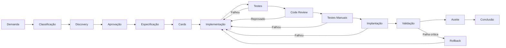
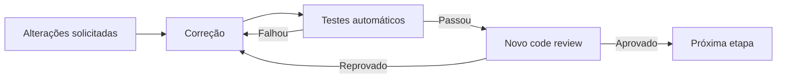
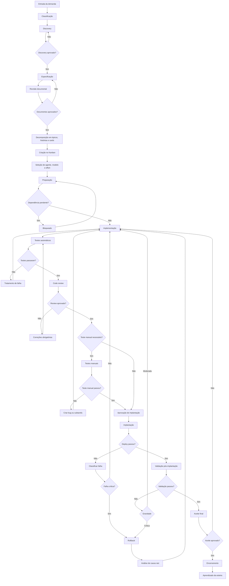
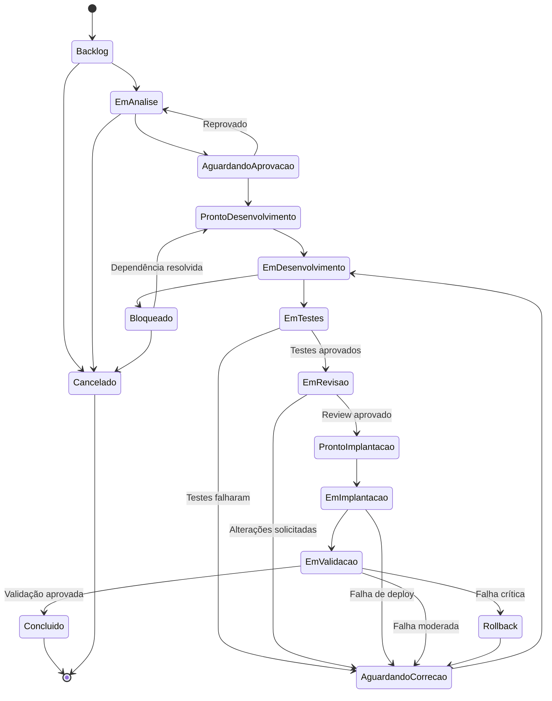

# Wireframes — Esteira Operacional Multiagente do ASO

## 1. Objetivo

Criar uma interface web para visualizar, controlar e auditar a esteira operacional multiagente do ASO.

O sistema deve representar o funcionamento de uma empresa automatizada de desenvolvimento de software, permitindo:

* Registrar demandas;
* Classificar demandas;
* Executar discovery;
* Produzir e aprovar documentos;
* Criar épicos, histórias, cards e subtarefas;
* Distribuir tarefas entre agentes;
* Selecionar modelos e níveis de effort;
* Acompanhar implementações;
* Executar testes automáticos e manuais;
* Realizar code review;
* Controlar implantação e rollback;
* Registrar falhas e retornos de fluxo;
* Exibir evidências e histórico de auditoria;
* Analisar o desempenho da esteira.

---

# 2. Diretrizes gerais da interface

## 2.1 Estilo visual

A interface deve utilizar inicialmente um estilo de wireframe:

* Fundo claro;
* Componentes em tons neutros;
* Bordas visíveis;
* Ícones simples;
* Tipografia legível;
* Hierarquia clara;
* Pouca ornamentação;
* Foco em estrutura, navegação e funcionalidade;
* Layout responsivo;
* Componentes reutilizáveis.

## 2.2 Estrutura principal

A aplicação deve possuir:

```text
┌──────────────────────────────────────────────────────────────┐
│ Header                                                       │
├──────────────┬───────────────────────────────────────────────┤
│ Sidebar      │ Área principal                                │
│              │                                               │
│              │                                               │
└──────────────┴───────────────────────────────────────────────┘
```

## 2.3 Header

O header deve conter:

* Logo do ASO;
* Nome do projeto atual;
* Seletor de ambiente;
* Indicador de execução ativa;
* Indicador de falhas;
* Indicador de tarefas aguardando aprovação;
* Campo de busca;
* Central de notificações;
* Perfil do usuário.

Exemplo:

```text
┌──────────────────────────────────────────────────────────────────────────┐
│ ASO │ Projeto: SID3 ▼ │ Ambiente: Produção ▼ │ Execuções: 4 │ Alertas: 2 │
│                                              Buscar... │ 🔔 │ Usuário     │
└──────────────────────────────────────────────────────────────────────────┘
```

## 2.4 Sidebar

A navegação lateral deve possuir:

```text
Dashboard
Demandas
Esteira
Kanban
Agentes
Modelos
Documentos
Aprovações
Execuções
Testes
Code Reviews
Implantações
Incidentes
Auditoria
Métricas
Configurações
```

---

# 3. Tela 01 — Dashboard operacional

## 3.1 Objetivo

Apresentar uma visão geral da operação da esteira.

## 3.2 Estrutura

```text
┌─────────────────────────────────────────────────────────────────────┐
│ Dashboard operacional                                               │
│ Visão consolidada da esteira                                        │
├─────────────────┬─────────────────┬─────────────────┬───────────────┤
│ Demandas ativas │ Em execução     │ Bloqueadas      │ Falhas abertas│
│ 18              │ 7               │ 3               │ 2             │
├─────────────────┴─────────────────┴─────────────────┴───────────────┤
│ Fluxo geral da esteira                                              │
│                                                                     │
│ Demanda → Discovery → Especificação → Cards → Implementação         │
│                ↑              ↓                  ↓                   │
│                └──── Correção / Reaprovação ← Testes / Review       │
├──────────────────────────────────────┬──────────────────────────────┤
│ Cards por status                     │ Aprovações pendentes          │
│                                      │                              │
│ Backlog: 12                          │ Discovery: 2                  │
│ Desenvolvimento: 8                   │ Arquitetura: 1                │
│ Testes: 5                            │ Deploy: 3                     │
│ Review: 4                            │ Aceite final: 1               │
├──────────────────────────────────────┴──────────────────────────────┤
│ Atividades recentes                                                 │
│ 14:32 — Card ASO-142 movido para Testes                             │
│ 14:28 — Teste de integração falhou                                  │
│ 14:20 — Agente Claude Opus atribuído ao card ASO-144                │
└─────────────────────────────────────────────────────────────────────┘
```

## 3.3 Componentes

### Cards de indicadores

Cada card deve exibir:

* Título;
* Valor atual;
* Variação;
* Indicador visual;
* Link para detalhamento.

### Fluxo resumido

Representar as principais etapas:



---

# 4. Tela 02 — Lista de demandas

## 4.1 Objetivo

Listar todas as demandas registradas na plataforma.

## 4.2 Filtros

Disponibilizar filtros por:

* Texto;
* Projeto;
* Tipo;
* Prioridade;
* Risco;
* Complexidade;
* Impacto;
* Status;
* Agente responsável;
* Data de criação;
* Necessidade de aprovação humana.

## 4.3 Wireframe

```text
┌─────────────────────────────────────────────────────────────────────┐
│ Demandas                                      [+ Nova demanda]      │
├─────────────────────────────────────────────────────────────────────┤
│ Buscar demanda...                                                   │
│ Tipo ▼ Prioridade ▼ Risco ▼ Complexidade ▼ Status ▼ Projeto ▼      │
├─────────┬─────────────────────────┬───────────┬──────────┬──────────┤
│ Código  │ Título                  │ Tipo      │ Prioridade│ Status   │
├─────────┼─────────────────────────┼───────────┼──────────┼──────────┤
│ DEM-142 │ Autenticação OAuth      │ Feature   │ Alta     │ Discovery│
│ DEM-143 │ Corrigir timeout        │ Bug       │ Crítica  │ Testes   │
│ DEM-144 │ Refatorar pagamentos    │ Refactor  │ Média    │ Backlog  │
└─────────┴─────────────────────────┴───────────┴──────────┴──────────┘
```

## 4.4 Ações por demanda

* Abrir;
* Editar;
* Duplicar;
* Priorizar;
* Bloquear;
* Cancelar;
* Visualizar histórico;
* Visualizar documentos;
* Visualizar cards;
* Reiniciar etapa;
* Solicitar intervenção humana.

---

# 5. Tela 03 — Cadastro de demanda

## 5.1 Objetivo

Registrar uma nova demanda.

## 5.2 Campos

### Informações gerais

* Título;
* Descrição;
* Projeto;
* Solicitante;
* Origem da demanda;
* Tipo;
* Resultado esperado.

### Contexto técnico

* Sistemas afetados;
* Módulos afetados;
* APIs afetadas;
* Banco de dados afetado;
* Infraestrutura afetada;
* Dependências conhecidas.

### Critérios

* Critérios de aceite;
* Restrições;
* Riscos conhecidos;
* Evidências esperadas.

### Configuração inicial

* Prioridade;
* Risco;
* Complexidade;
* Impacto;
* Aprovação humana obrigatória;
* Prazo;
* Orçamento ou limite de custo.

## 5.3 Wireframe

```text
┌───────────────────────────────────────────────────────────────┐
│ Nova demanda                                                  │
├───────────────────────────────────────────────────────────────┤
│ Título                                                        │
│ [___________________________________________________________] │
│                                                               │
│ Descrição                                                     │
│ [___________________________________________________________] │
│ [___________________________________________________________] │
│                                                               │
│ Projeto [____________▼] Tipo [____________▼]                  │
│ Prioridade [_________▼] Risco [___________▼]                  │
│ Complexidade [_______▼] Impacto [_________▼]                  │
│                                                               │
│ Critérios de aceite                                           │
│ [+ Adicionar critério]                                        │
│                                                               │
│ Sistemas e módulos afetados                                   │
│ [___________________________________________________________] │
│                                                               │
│ [Cancelar]                         [Salvar rascunho] [Iniciar] │
└───────────────────────────────────────────────────────────────┘
```

---

# 6. Tela 04 — Detalhes da demanda

## 6.1 Objetivo

Centralizar todas as informações relacionadas a uma demanda.

## 6.2 Cabeçalho

Exibir:

* Código;
* Título;
* Status;
* Prioridade;
* Risco;
* Complexidade;
* Impacto;
* Projeto;
* Solicitante;
* Data de criação;
* Percentual de progresso.

## 6.3 Abas

```text
Visão geral
Discovery
Documentos
Cards
Execuções
Testes
Reviews
Deploys
Incidentes
Histórico
Métricas
```

## 6.4 Wireframe

```text
┌────────────────────────────────────────────────────────────────────┐
│ DEM-142 — Implementar autenticação OAuth                           │
│ Status: Em desenvolvimento │ Prioridade: Alta │ Risco: Moderado    │
│ Progresso: ███████████░░░░ 72%                                     │
├────────────────────────────────────────────────────────────────────┤
│ Visão geral │ Discovery │ Documentos │ Cards │ Testes │ Histórico  │
├────────────────────────────────────┬───────────────────────────────┤
│ Objetivo                           │ Responsáveis                  │
│ Implementar login via OAuth...     │ Orquestrador: Agent-01        │
│                                    │ Arquiteto: Claude Opus        │
│ Critérios de aceite                │ Implementação: Codex Sol      │
│ ✓ Login com provedor               │ Review: Claude Sonnet         │
│ ✓ Persistência de token            │                               │
│ ○ Renovação automática             │                               │
├────────────────────────────────────┴───────────────────────────────┤
│ Linha do tempo                                                    │
│ Demanda → Discovery → Documentação → Cards → Desenvolvimento      │
└────────────────────────────────────────────────────────────────────┘
```

---

# 7. Tela 05 — Classificação da demanda

## 7.1 Objetivo

Permitir que o agente orquestrador classifique a demanda.

## 7.2 Campos

```text
Tipo:
- Funcionalidade
- Correção
- Refatoração
- Arquitetura
- Infraestrutura
- Investigação
- Documentação
- Segurança
- Desempenho
- Produto

Prioridade:
- Baixa
- Média
- Alta
- Crítica

Risco:
- Baixo
- Moderado
- Alto
- Crítico

Complexidade:
- Simples
- Intermediária
- Complexa
- Estratégica

Impacto:
- Isolado
- Parcial
- Sistêmico
```

## 7.3 Resultado da classificação

O sistema deve recomendar:

* Agente;
* Plataforma;
* Modelo;
* Effort;
* Necessidade de revisão humana;
* Número estimado de cards;
* Quality gates necessários.

---

# 8. Tela 06 — Discovery técnico

## 8.1 Objetivo

Executar e apresentar a investigação técnica da demanda.

## 8.2 Painel de execução

```text
┌──────────────────────────────────────────────────────────────────┐
│ Discovery técnico                                                │
├────────────────────────────────┬─────────────────────────────────┤
│ Agente responsável            │ Claude Opus                     │
│ Modelo                         │ Opus                            │
│ Effort                         │ Máximo                          │
│ Status                         │ Em execução                     │
│ Tempo decorrido                │ 18 min                          │
├────────────────────────────────┴─────────────────────────────────┤
│ Etapas da análise                                                │
│ ✓ Estrutura do projeto                                          │
│ ✓ Código existente                                              │
│ ✓ Documentação                                                   │
│ ✓ Banco de dados                                                 │
│ → Dependências externas                                         │
│ ○ Testes existentes                                             │
│ ○ Impactos sistêmicos                                           │
├──────────────────────────────────────────────────────────────────┤
│ Logs da execução                                                 │
│ 14:02 Projeto carregado                                          │
│ 14:04 Módulo authentication identificado                         │
│ 14:08 Dependência OAuth detectada                                │
└──────────────────────────────────────────────────────────────────┘
```

## 8.3 Relatório produzido

O relatório deve possuir:

```markdown
# Relatório de Discovery

## Situação atual

## Problema identificado

## Componentes afetados

## Regras de negócio

## Dependências

## Restrições

## Riscos

## Alternativas possíveis

## Recomendação técnica

## Impacto estimado

## Pontos que exigem decisão

## Nível de confiança do agente
```

---

# 9. Tela 07 — Aprovação do discovery

## 9.1 Objetivo

Permitir aprovação automática ou humana.

## 9.2 Critérios para aprovação automática

Mostrar checklist:

* Baixo risco;
* Escopo claro;
* Sem mudança relevante de arquitetura;
* Sem risco de perda de dados;
* Sem impacto financeiro significativo;
* Padrões já aprovados;
* Alta confiança do agente.

## 9.3 Wireframe

```text
┌────────────────────────────────────────────────────────────────┐
│ Aprovação do discovery                                         │
├──────────────────────────────────────┬─────────────────────────┤
│ Documento                            │ Avaliação automática    │
│ Relatório Discovery v3               │ Risco: Moderado         │
│ Autor: Claude Opus                   │ Confiança: 91%          │
│ Criado em: 04/08/2026                │ Recomendação: Humana    │
├──────────────────────────────────────┴─────────────────────────┤
│ Motivos para aprovação humana                                 │
│ • Alteração de arquitetura                                    │
│ • Duas soluções tecnicamente viáveis                          │
├────────────────────────────────────────────────────────────────┤
│ Comentário da aprovação                                       │
│ [___________________________________________________________] │
│                                                                │
│ [Reprovar] [Solicitar ajustes] [Aprovar com observações]       │
│                                               [Aprovar]         │
└────────────────────────────────────────────────────────────────┘
```

---

# 10. Tela 08 — Documentos e especificações

## 10.1 Tipos de documento

* Requisitos;
* Especificação funcional;
* Especificação técnica;
* Arquitetura;
* Diagrama de componentes;
* Diagrama de fluxo;
* Modelo de dados;
* Contrato de API;
* Plano de migração;
* Plano de testes;
* Plano de implantação;
* Plano de rollback;
* Checklist de segurança.

## 10.2 Lista de documentos

```text
┌────────────────────────────────────────────────────────────────────┐
│ Documentos                                      [+ Novo documento] │
├───────────┬───────────────────────────┬──────────┬──────────┬──────┤
│ Versão    │ Documento                 │ Autor    │ Status   │ Ações│
├───────────┼───────────────────────────┼──────────┼──────────┼──────┤
│ v3        │ Especificação técnica     │ Opus     │ Aprovado │ Abrir│
│ v2        │ Plano de testes           │ Sonnet   │ Revisão  │ Abrir│
│ v1        │ Plano de rollback         │ Opus     │ Ajustes  │ Abrir│
└───────────┴───────────────────────────┴──────────┴──────────┴──────┘
```

## 10.3 Editor de documento

O editor deve possuir:

* Visualização Markdown;
* Visualização renderizada;
* Histórico de versões;
* Comparação de versões;
* Comentários;
* Aprovação;
* Solicitação de alterações;
* Referências a código;
* Referências a cards;
* Referências a outros documentos.

---

# 11. Tela 09 — Revisão documental

## 11.1 Checklist do revisor

* Consistência;
* Completude;
* Viabilidade;
* Segurança;
* Compatibilidade;
* Critérios de aceite;
* Plano de testes;
* Plano de rollback;
* Contradições;
* Impactos não considerados.

## 11.2 Resultado

```text
Aprovado
Aprovado com observações
Reprovado
Necessita decisão humana
```

## 11.3 Comentários

Cada comentário deve conter:

* Autor;
* Tipo;
* Severidade;
* Trecho relacionado;
* Descrição;
* Ação solicitada;
* Status;
* Resposta do autor.

---

# 12. Tela 10 — Estrutura da demanda

## 12.1 Objetivo

Visualizar a decomposição da demanda.

```text
Projeto
 └── Épico
      ├── História 01
      │    ├── Card 01
      │    ├── Card 02
      │    └── Card 03
      └── História 02
           ├── Card 04
           └── Card 05
```

## 12.2 Wireframe

```text
┌──────────────────────────────────────────────────────────────────┐
│ Estrutura da demanda                           [+ Criar item]    │
├──────────────────────────────────────────────────────────────────┤
│ ▼ Épico: Autenticação OAuth                                      │
│   ▼ História: Login                                              │
│     ├─ ASO-101 Configurar provedor                               │
│     ├─ ASO-102 Criar endpoint de login                           │
│     └─ ASO-103 Implementar callback                              │
│   ▼ História: Tokens                                             │
│     ├─ ASO-104 Persistir tokens                                  │
│     └─ ASO-105 Renovar token                                     │
└──────────────────────────────────────────────────────────────────┘
```

---

# 13. Tela 11 — Kanban operacional

## 13.1 Colunas

```text
Backlog
Em análise
Aguardando aprovação
Pronto para desenvolvimento
Em desenvolvimento
Em testes
Em revisão
Aguardando correção
Pronto para implantação
Em implantação
Em validação
Concluído
Bloqueado
Cancelado
```

## 13.2 Wireframe

```text
┌────────────┬────────────┬────────────┬────────────┬────────────┐
│ Backlog    │ Desenvolv. │ Testes     │ Review     │ Concluído  │
├────────────┼────────────┼────────────┼────────────┼────────────┤
│ ASO-101    │ ASO-104    │ ASO-102    │ ASO-100    │ ASO-099    │
│ OAuth cfg  │ Tokens     │ Endpoint   │ Migration  │ Docs       │
│ Alta       │ Alta       │ Média      │ Crítica    │ Baixa      │
│ Terra      │ Sol        │ Luna       │ Opus       │ Sonnet     │
│ Effort M   │ Effort A   │ Effort M   │ Effort Máx │ Effort B   │
└────────────┴────────────┴────────────┴────────────┴────────────┘
```

## 13.3 Card resumido

Cada card no Kanban deve mostrar:

* Código;
* Título;
* Prioridade;
* Agente;
* Modelo;
* Effort;
* Quantidade de tentativas;
* Quantidade de falhas;
* Indicador de bloqueio;
* Indicador de aprovação humana;
* Tempo na etapa.

---

# 14. Tela 12 — Detalhes do card

## 14.1 Informações obrigatórias

```markdown
# Card

## Identificação

- Código
- Título
- Tipo
- Status
- Prioridade
- Complexidade
- Risco

## Objetivo

## Contexto

## Descrição

## Dependências

## Critérios de aceite

## Arquivos e módulos envolvidos

## Riscos

## Agente responsável

## Modelo selecionado

## Nível de effort

## Evidências esperadas

## Testes obrigatórios

## Histórico de execução
```

## 14.2 Abas

```text
Resumo
Plano
Implementação
Arquivos
Testes
Review
Evidências
Dependências
Execuções
Histórico
```

---

# 15. Tela 13 — Seleção de agente, modelo e effort

## 15.1 Objetivo

Permitir que o orquestrador selecione a configuração de execução.

## 15.2 Campos

### Plataforma

* Codex;
* Claude.

### Modelos

* Sonnet;
* Opus;
* Luna;
* Terra;
* Sol.

### Effort

* Baixo;
* Médio;
* Alto;
* Máximo.

## 15.3 Painel de recomendação

```text
┌──────────────────────────────────────────────────────────────┐
│ Configuração recomendada                                     │
├──────────────────────────────────────────────────────────────┤
│ Plataforma: Claude                                           │
│ Modelo: Opus                                                 │
│ Effort: Alto                                                 │
│ Confiança: 92%                                               │
│                                                              │
│ Motivos                                                      │
│ • Alteração de arquitetura                                   │
│ • Leitura extensa de código                                  │
│ • Risco de regressão                                         │
│ • Necessidade de raciocínio avançado                         │
├──────────────────────────────────────────────────────────────┤
│ Custo estimado: Alto                                         │
│ Tempo estimado: Médio                                        │
│ Revisão humana: Recomendada                                  │
└──────────────────────────────────────────────────────────────┘
```

## 15.4 Histórico de desempenho

Exibir o desempenho anterior do modelo:

* Taxa de sucesso;
* Taxa de retrabalho;
* Média de tentativas;
* Custo médio;
* Tempo médio;
* Tipos de tarefa com melhor desempenho.

---

# 16. Tela 14 — Preparação para implementação

## 16.1 Checklist

```text
[ ] Especificação lida
[ ] Critérios de aceite analisados
[ ] Código afetado analisado
[ ] Dependências verificadas
[ ] Testes existentes identificados
[ ] Branch criada
[ ] Plano de execução registrado
[ ] Card desbloqueado
```

## 16.2 Dependências

Caso exista dependência pendente:

```text
Status do card: Bloqueado

Dependência:
ASO-087 — Criar credenciais OAuth

Ações:
[Visualizar dependência]
[Criar tarefa vinculada]
[Alterar responsável]
[Solicitar intervenção]
```

---

# 17. Tela 15 — Execução da implementação

## 17.1 Painel da execução

```text
┌────────────────────────────────────────────────────────────────────┐
│ Execução EXE-944                                                   │
├──────────────────────────┬─────────────────────────────────────────┤
│ Card                     │ ASO-104                                 │
│ Agente                   │ Codex Sol                               │
│ Effort                   │ Alto                                    │
│ Status                   │ Em execução                             │
│ Branch                   │ feat/oauth-token-persistence            │
│ Início                   │ 04/08/2026 14:20                        │
├──────────────────────────┴─────────────────────────────────────────┤
│ Plano de execução                                                  │
│ ✓ Analisar entidade User                                           │
│ ✓ Criar entidade OAuthToken                                        │
│ → Implementar repositório                                          │
│ ○ Criar migration                                                  │
│ ○ Criar testes                                                     │
├────────────────────────────────────────────────────────────────────┤
│ Logs                                                               │
│ 14:22 Arquivo OAuthToken.ts criado                                 │
│ 14:24 Repositório implementado                                     │
│ 14:28 Executando testes unitários                                  │
├────────────────────────────────────────────────────────────────────┤
│ Arquivos alterados                                                 │
│ src/auth/OAuthToken.ts                                             │
│ src/auth/OAuthTokenRepository.ts                                   │
└────────────────────────────────────────────────────────────────────┘
```

## 17.2 Controles

* Pausar;
* Cancelar;
* Aumentar effort;
* Trocar modelo;
* Adicionar contexto;
* Solicitar ajuda;
* Transferir para outro agente;
* Marcar como bloqueado.

---

# 18. Tela 16 — Quality gates

## 18.1 Validações

```text
Formatação
Lint
Compilação
Type checking
Testes unitários
Testes de integração
Testes de contrato
Testes end-to-end
Análise estática
Dependências
Vulnerabilidades
Migrations
Documentação
Cobertura
Desempenho
```

## 18.2 Wireframe

```text
┌──────────────────────────────────────────────────────────────────┐
│ Quality gates                                                    │
├─────────────────────────────┬───────────┬───────────┬────────────┤
│ Validação                   │ Status    │ Duração   │ Evidência  │
├─────────────────────────────┼───────────┼───────────┼────────────┤
│ Formatação                  │ Passou    │ 4s        │ Ver log    │
│ Lint                        │ Passou    │ 12s       │ Ver log    │
│ Compilação                  │ Passou    │ 31s       │ Ver log    │
│ Testes unitários            │ Falhou    │ 52s       │ Ver erro   │
│ Testes de integração        │ Pendente  │ —         │ —          │
└─────────────────────────────┴───────────┴───────────┴────────────┘
```

---

# 19. Tela 17 — Tratamento de falhas

## 19.1 Informações da falha

* Comando;
* Teste;
* Mensagem;
* Stack trace;
* Arquivos relacionados;
* Ambiente;
* Tentativa;
* Mudança potencialmente responsável;
* Classificação da falha.

## 19.2 Decisão do orquestrador

```text
Manter o mesmo agente
Trocar agente
Trocar modelo
Aumentar effort
Criar investigação separada
Solicitar revisão humana
Bloquear demanda
```

## 19.3 Wireframe

```text
┌──────────────────────────────────────────────────────────────────┐
│ Falha detectada                                                  │
├──────────────────────────────────────────────────────────────────┤
│ Quality gate: Testes unitários                                   │
│ Teste: OAuthTokenService.shouldRefreshExpiredToken               │
│ Erro: Expected token expiration to be renewed                    │
│ Tentativa: 2 de 5                                                │
├──────────────────────────────────────────────────────────────────┤
│ Diagnóstico automático                                           │
│ Provável causa: cálculo incorreto de expiração                    │
│ Confiança: 84%                                                   │
├──────────────────────────────────────────────────────────────────┤
│ Próxima ação                                                     │
│ (•) Mesmo agente                                                 │
│ ( ) Agente diferente                                             │
│ ( ) Modelo mais avançado                                         │
│                                                              │
│ Effort atual: Médio          Novo effort: Alto ▼                  │
│                                                              │
│ [Bloquear] [Escalar para humano] [Reexecutar correção]            │
└──────────────────────────────────────────────────────────────────┘
```

---

# 20. Tela 18 — Code review

## 20.1 Resumo

Exibir:

* Autor da implementação;
* Revisor;
* Pull request;
* Branch;
* Commits;
* Arquivos alterados;
* Linhas adicionadas e removidas;
* Resultado dos testes.

## 20.2 Checklist

```text
Correção
Aderência aos requisitos
Qualidade
Clareza
Manutenibilidade
Segurança
Tratamento de erros
Performance
Padrões
Cobertura de testes
Risco de regressão
Escopo
```

## 20.3 Comentários

Cada comentário deve possuir:

* Arquivo;
* Linha;
* Categoria;
* Severidade;
* Descrição;
* Sugestão;
* Obrigatório ou opcional;
* Status da resolução.

## 20.4 Resultado

```text
Aprovado
Aprovado com sugestões
Alterações obrigatórias
Reprovado
Necessita revisão humana
```

---

# 21. Tela 19 — Correções do review

## 21.1 Lista de ações

```text
[ ] Corrigir tratamento de exceção
[ ] Remover duplicação
[ ] Adicionar teste de erro
[ ] Ajustar nome do método
[ ] Reduzir acoplamento
[ ] Corrigir risco de segurança
[ ] Atualizar documentação
```

## 21.2 Fluxo obrigatório



---

# 22. Tela 20 — Testes manuais

## 22.1 Plano de teste

Cada cenário deve conter:

* Código;
* Título;
* Pré-condições;
* Passos;
* Resultado esperado;
* Resultado obtido;
* Responsável;
* Ambiente;
* Evidências;
* Status.

## 22.2 Wireframe

```text
┌──────────────────────────────────────────────────────────────────┐
│ Testes manuais                                                   │
├────────┬──────────────────────────────┬──────────┬───────────────┤
│ Código │ Cenário                      │ Status   │ Responsável   │
├────────┼──────────────────────────────┼──────────┼───────────────┤
│ QA-001 │ Login com usuário novo       │ Passou   │ QA Agent      │
│ QA-002 │ Renovação de token expirado  │ Falhou   │ Usuário       │
│ QA-003 │ Logout                       │ Pendente │ QA Agent      │
└────────┴──────────────────────────────┴──────────┴───────────────┘
```

---

# 23. Tela 21 — Registro de bug manual

## 23.1 Campos

* Título;
* Card original;
* Cenário;
* Passos para reproduzir;
* Ambiente;
* Resultado atual;
* Resultado esperado;
* Evidências;
* Gravidade;
* Impacto;
* Frequência;
* Agente sugerido.

## 23.2 Retorno de fluxo

O sistema deve permitir selecionar:

```text
Retornar para implementação
Retornar para infraestrutura
Retornar para banco de dados
Retornar para documentação
Retornar para arquitetura
Criar card independente
```

---

# 24. Tela 22 — Aprovação para implantação

## 24.1 Checklist

```text
[ ] Pull request aprovado
[ ] Testes aprovados
[ ] Migrations validadas
[ ] Variáveis configuradas
[ ] Documentação atualizada
[ ] Plano de rollback disponível
[ ] Dependências implantadas
[ ] Janela de implantação definida
[ ] Aprovação humana realizada
```

## 24.2 Avaliação de risco

Exibir:

* Risco da implantação;
* Probabilidade de falha;
* Impacto potencial;
* Possibilidade de rollback;
* Necessidade de janela de manutenção;
* Aprovação automática ou humana.

---

# 25. Tela 23 — Implantação

## 25.1 Pipeline

```text
Desenvolvimento
Testes
Homologação
Staging
Produção
```

## 25.2 Wireframe

```text
┌──────────────────────────────────────────────────────────────────┐
│ Implantação DEP-388                                              │
├──────────────────────────────────────────────────────────────────┤
│ Desenvolvimento  ✓                                               │
│ Testes          ✓                                                │
│ Homologação     ✓                                                │
│ Staging         → Em execução                                    │
│ Produção        ○ Pendente                                       │
├──────────────────────────────────────────────────────────────────┤
│ Versão: 2.8.0                                                    │
│ Commit: a8fd921                                                  │
│ Branch: main                                                     │
│ Responsável: Deploy Agent                                        │
│ Início: 04/08/2026 15:42                                         │
├──────────────────────────────────────────────────────────────────┤
│ Logs                                                             │
│ 15:42 Iniciando build                                            │
│ 15:44 Criando imagem Docker                                      │
│ 15:46 Aplicando migration                                        │
└──────────────────────────────────────────────────────────────────┘
```

---

# 26. Tela 24 — Validação pós-implantação

## 26.1 Validações

* Health check;
* Smoke tests;
* Rotas;
* Autenticação;
* Logs;
* Métricas;
* Banco;
* Filas;
* Integrações;
* Monitoramento de erros.

## 26.2 Resultado

```text
Saudável
Saudável com alertas
Instável
Falha crítica
```

## 26.3 Decisão

```text
Concluir implantação
Iniciar correção
Executar rollback
Solicitar análise humana
Manter monitoramento
```

---

# 27. Tela 25 — Rollback

## 27.1 Estratégias

* Voltar versão;
* Reverter configuração;
* Desabilitar feature flag;
* Restaurar banco;
* Suspender filas;
* Desativar integração.

## 27.2 Wireframe

```text
┌──────────────────────────────────────────────────────────────────┐
│ Rollback                                                         │
├──────────────────────────────────────────────────────────────────┤
│ Incidente: INC-092                                               │
│ Deploy: DEP-388                                                  │
│ Gravidade: Crítica                                               │
│ Motivo: Erro na renovação de tokens                              │
├──────────────────────────────────────────────────────────────────┤
│ Estratégia                                                       │
│ (•) Voltar para versão 2.7.4                                     │
│ ( ) Desabilitar feature flag                                     │
│ ( ) Restaurar banco                                              │
├──────────────────────────────────────────────────────────────────┤
│ Checklist                                                        │
│ [ ] Confirmar versão anterior                                    │
│ [ ] Validar compatibilidade do banco                             │
│ [ ] Suspender novas execuções                                    │
│ [ ] Executar rollback                                            │
│ [ ] Rodar smoke tests                                            │
│ [ ] Abrir análise de causa raiz                                  │
│                                                                  │
│ [Cancelar]                              [Executar rollback]       │
└──────────────────────────────────────────────────────────────────┘
```

---

# 28. Tela 26 — Aceite final

## 28.1 Critérios

* Critérios de aceite atendidos;
* Testes aprovados;
* Comportamento correto;
* Documentação atualizada;
* Implantação concluída;
* Sem pendências bloqueadoras.

## 28.2 Tipos

```text
Aceite automático
Aceite humano
Aceite de produto
Aceite técnico
Aceite de negócio
```

---

# 29. Tela 27 — Encerramento

## 29.1 Relatório final

O encerramento deve apresentar:

```markdown
# Encerramento da demanda

## Resumo da entrega

## Agentes utilizados

## Modelos utilizados

## Effort utilizado

## Cards concluídos

## Commits

## Pull requests

## Documentos produzidos

## Testes executados

## Evidências

## Data da implantação

## Decisões técnicas

## Riscos residuais

## Pendências futuras
```

## 29.2 Wireframe

```text
┌──────────────────────────────────────────────────────────────────┐
│ Demanda concluída                                                │
├──────────────────────────────────────────────────────────────────┤
│ DEM-142 — Autenticação OAuth                                     │
│ Status: Concluído                                                │
│ Data: 04/08/2026                                                 │
│ Duração total: 3 dias                                            │
├───────────────────────┬──────────────────────────────────────────┤
│ Cards                 │ 10 concluídos                            │
│ Agentes               │ 5 utilizados                             │
│ Execuções             │ 17                                       │
│ Falhas corrigidas     │ 4                                        │
│ Intervenções humanas  │ 2                                        │
│ Deploys               │ 2                                        │
├───────────────────────┴──────────────────────────────────────────┤
│ [Exportar relatório] [Visualizar auditoria] [Encerrar demanda]  │
└──────────────────────────────────────────────────────────────────┘
```

---

# 30. Tela 28 — Auditoria

## 30.1 Objetivo

Registrar todas as ações realizadas na esteira.

## 30.2 Informações

Cada registro deve possuir:

* Data e hora;
* Projeto;
* Demanda;
* Card;
* Etapa;
* Agente;
* Modelo;
* Effort;
* Ação;
* Motivo;
* Resultado;
* Evidências;
* Próxima ação;
* Identificador da execução.

## 30.3 Wireframe

```text
┌────────────────────────────────────────────────────────────────────┐
│ Auditoria                                                          │
├────────────────────────────────────────────────────────────────────┤
│ Data ▼ Projeto ▼ Demanda ▼ Agente ▼ Etapa ▼ Resultado ▼           │
├──────────────────┬──────────┬──────────────┬───────────┬──────────┤
│ Data             │ Card     │ Ação         │ Agente    │ Resultado│
├──────────────────┼──────────┼──────────────┼───────────┼──────────┤
│ 04/08 15:32      │ ASO-104  │ Rodou testes │ Codex Sol │ Falhou   │
│ 04/08 15:40      │ ASO-104  │ Corrigiu bug │ Codex Sol │ Sucesso  │
│ 04/08 15:52      │ ASO-104  │ Code review  │ Opus      │ Aprovado │
└──────────────────┴──────────┴──────────────┴───────────┴──────────┘
```

---

# 31. Tela 29 — Métricas e aprendizado

## 31.1 Indicadores

* Tempo médio por demanda;
* Tempo médio por etapa;
* Taxa de aprovação;
* Taxa de retrabalho;
* Quantidade de falhas;
* Falhas por categoria;
* Falhas por modelo;
* Falhas por agente;
* Custo por demanda;
* Custo por modelo;
* Intervenções humanas;
* Número médio de tentativas;
* Taxa de rollback;
* Cobertura de testes;
* Taxa de sucesso no primeiro ciclo.

## 31.2 Comparação de modelos

```text
┌─────────┬──────────────┬────────────┬────────────┬───────────────┐
│ Modelo  │ Sucesso      │ Retrabalho │ Custo médio│ Tempo médio   │
├─────────┼──────────────┼────────────┼────────────┼───────────────┤
│ Sonnet  │ 88%          │ 12%        │ Baixo      │ 8 min         │
│ Opus    │ 96%          │ 4%         │ Alto       │ 21 min        │
│ Luna    │ 84%          │ 16%        │ Baixo      │ 6 min         │
│ Terra   │ 91%          │ 9%         │ Médio      │ 11 min        │
│ Sol     │ 95%          │ 5%         │ Alto       │ 17 min        │
└─────────┴──────────────┴────────────┴────────────┴───────────────┘
```

## 31.3 Recomendações automáticas

O sistema pode sugerir:

* Aumentar effort para determinada categoria;
* Evitar modelo em tarefa específica;
* Criar novo agente especializado;
* Adicionar teste automático;
* Modificar critérios de aprovação;
* Alterar limite de tentativas;
* Criar template de card;
* Ajustar regras de roteamento.

---

# 32. Tela 30 — Configuração de agentes

## 32.1 Informações do agente

* Nome;
* Tipo;
* Função;
* Plataforma;
* Modelos permitidos;
* Efforts permitidos;
* Ferramentas;
* Permissões;
* Projetos;
* Categorias de tarefa;
* Limite de custo;
* Limite de tentativas;
* Necessidade de supervisão.

## 32.2 Exemplos de agentes

```text
Orquestrador
Discovery técnico
Arquiteto
Analista de requisitos
Desenvolvedor backend
Desenvolvedor frontend
Especialista em banco
Especialista em infraestrutura
QA
Code reviewer
Segurança
Deploy
Incidentes
Documentação
```

---

# 33. Tela 31 — Regras de roteamento

## 33.1 Estrutura da regra

```text
Quando:
- Tipo da demanda for Segurança
- Risco for Alto ou Crítico
- Complexidade for Complexa ou Estratégica

Então:
- Utilizar Claude Opus
- Effort Máximo
- Exigir revisão humana
- Exigir scan de vulnerabilidades
- Exigir code review por agente diferente
- Limitar a 3 tentativas automáticas
```

## 33.2 Editor de regra

```text
SE [Campo ▼] [Operador ▼] [Valor ▼]
E  [Campo ▼] [Operador ▼] [Valor ▼]

ENTÃO
Agente [____________▼]
Modelo [____________▼]
Effort [____________▼]
Aprovação humana [Sim/Não]
Quality gates [Selecionar]
```

---

# 34. Fluxo completo da esteira



---

# 35. Máquina de estados do card



---

# 36. Regras funcionais obrigatórias

## 36.1 Separação de responsabilidades

* O agente que implementa não deve ser o único agente que aprova;
* O agente revisor deve ser diferente do agente implementador;
* Alterações críticas devem exigir aprovação humana;
* Aprovações automáticas devem ser justificadas;
* Toda decisão deve possuir registro de auditoria.

## 36.2 Tratamento de falhas

Nenhuma falha pode encerrar silenciosamente uma execução.

Toda falha deve:

1. Ser registrada;
2. Ser classificada;
3. Possuir evidências;
4. Identificar a etapa responsável;
5. Definir a próxima ação;
6. Retornar para a etapa adequada;
7. Reexecutar todas as validações relevantes.

## 36.3 Escalonamento

O orquestrador poderá:

* Manter o agente;
* Trocar o agente;
* Trocar o modelo;
* Aumentar o effort;
* Criar uma tarefa de investigação;
* Solicitar revisão humana;
* Bloquear a execução;
* Cancelar formalmente a demanda.

## 36.4 Limite de tentativas

Cada card deve possuir:

* Número máximo de tentativas;
* Número atual de tentativas;
* Histórico de falhas;
* Regras de escalonamento.

Exemplo:

```text
Tentativa 1:
- Modelo: Luna
- Effort: Médio
- Resultado: Falhou

Tentativa 2:
- Modelo: Terra
- Effort: Alto
- Resultado: Falhou

Tentativa 3:
- Modelo: Opus
- Effort: Máximo
- Resultado: Escalado para humano
```

---

# 37. Evidências obrigatórias

Cada etapa deve produzir evidências.

## Discovery

* Relatório;
* Arquivos analisados;
* Dependências;
* Riscos;
* Recomendação.

## Documentação

* Documento;
* Versão;
* Comentários;
* Aprovação.

## Implementação

* Branch;
* Commits;
* Arquivos alterados;
* Resumo;
* Decisões;
* Limitações.

## Testes

* Comandos;
* Logs;
* Cobertura;
* Resultados;
* Erros.

## Review

* Comentários;
* Aprovação;
* Alterações solicitadas.

## Implantação

* Versão;
* Commit;
* Ambiente;
* Logs;
* Duração;
* Resultado.

## Validação

* Health checks;
* Smoke tests;
* Logs;
* Métricas;
* Evidências funcionais.

---

# 38. Entidades principais sugeridas

```text
Project
Demand
Discovery
Document
DocumentVersion
Approval
Epic
Story
Card
Subtask
Checklist
Agent
AgentCapability
Model
EffortLevel
Assignment
Execution
ExecutionStep
QualityGate
TestRun
TestResult
CodeReview
ReviewComment
Deployment
Environment
PostDeploymentValidation
Rollback
Incident
Evidence
AuditLog
Metric
RoutingRule
HumanIntervention
```

---

# 39. Requisitos de experiência do usuário

* Toda tela deve informar claramente o status atual;
* Toda falha deve indicar a próxima ação;
* Todo item bloqueado deve indicar a dependência;
* Toda aprovação deve mostrar os critérios utilizados;
* Toda execução deve mostrar agente, modelo e effort;
* Todo retorno de fluxo deve ser visualmente identificado;
* Usuários devem conseguir navegar da demanda até qualquer evidência;
* O sistema deve evitar ações irreversíveis sem confirmação;
* A interface deve destacar riscos críticos;
* A interface deve diferenciar decisões automáticas e humanas;
* O histórico nunca deve ser sobrescrito;
* Cada alteração deve gerar uma nova entrada de auditoria.

---

# 40. Resultado esperado da implementação

O agente responsável pela implementação deve entregar:

1. Mapa das páginas;
2. Componentes reutilizáveis;
3. Estrutura de rotas;
4. Modelos de dados;
5. Wireframes navegáveis;
6. Fluxo completo de estados;
7. Simulação de falhas e retornos;
8. Kanban funcional;
9. Painel de agentes e modelos;
10. Painel de execuções;
11. Painel de testes;
12. Painel de aprovações;
13. Painel de implantação;
14. Auditoria completa;
15. Dashboard de métricas.

---

# 41. Instrução final para o agente

Interprete este documento como a especificação funcional e visual inicial da plataforma ASO.

Antes de implementar:

1. Analise todas as telas;
2. Identifique componentes compartilhados;
3. Defina a arquitetura frontend;
4. Defina os estados da aplicação;
5. Defina os contratos de dados;
6. Defina a navegação;
7. Produza os wireframes;
8. Valide todos os fluxos de sucesso;
9. Valide todos os fluxos de falha;
10. Garanta que todo retorno ocorra para a etapa correta.

Não simplifique a esteira para um fluxo linear.

O sistema deve representar ciclos de revisão, correção, reexecução, escalonamento, bloqueio, rollback e aprovação humana.

O princípio central é:

> Nenhuma falha deve encerrar silenciosamente a execução. Toda falha deve ser registrada, classificada e direcionada de volta à etapa responsável, repetindo as validações necessárias até a aprovação ou bloqueio formal.
